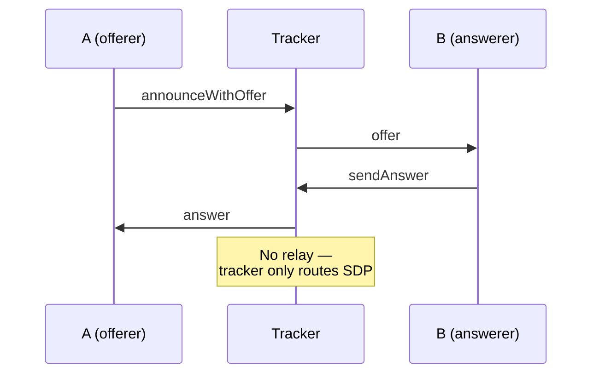

# TruSTI

A privacy-first Android app for sharing STI test results with trusted contacts. Two people exchange a QR code once; after that they can share encrypted health status updates peer-to-peer, with no server ever seeing message content.

---

## How It Works

### 1. Identity & Key Exchange

Every user has a permanent EC P-256 key pair generated on first launch and stored in SharedPreferences (`crypto/KeyManager.kt`). The public key is the user's identity — there is no account, username, or server registration.

Adding a contact is done by scanning their QR code. The QR encodes a URI:

```
trusti://peer?pk=<BASE64URL_PUBKEY>
```

This gives you their public key, which is all you need to:
- Derive a shared signaling room for reconnection
- Encrypt messages only they can read

### 2. Signaling via WebTorrent Tracker

Peers need to find each other to establish a direct connection. TruSTI uses a public WebTorrent tracker (`wss://tracker.openwebtorrent.com`) as a rendezvous point — the same infrastructure BitTorrent clients use to find peers for a torrent.

**The tracker never sees message content.** It only routes WebRTC signaling messages (SDP offer/answer) between peers.

Two room types are used (both derived with SHA-256):

| Room           | Derivation                    | Purpose                                                             |
| ------         | -----------                   | ---------                                                           |
| Handshake room | `sha256(B's public key)`      | B listens here so A can reach them after scanning the QR            |
| Permanent room | `sha256(sort(A_key + B_key))` | Both peers announce here for reconnection after the first handshake |

On startup, the app announces itself in its own handshake room and in a permanent room for every saved contact.

#### First-Time Connection Flow (A scans B's QR)

```mermaid
sequenceDiagram
    participant A as A Device<br/>(WebRTC)
    participant STUN_A as STUN/TURN ICE<br/>(stun.l.google.com)
    participant Tracker as WebTorrent Tracker<br/>(wss://tracker.ow.com)
    participant STUN_B as STUN/TURN ICE<br/>(stun.l.google.com)
    participant B as B Device<br/>(WebRTC)

    Note over B: B joins sha256(B_pk)
    Note over A: A scans B's QR

    A->>STUN_A: gather ICE
    A->>Tracker: announce(offer w/SDP+ICE)<br/>to sha256(B_pk)
    Tracker->>B: route offer

    B->>STUN_B: gather ICE
    B->>Tracker: sendAnswer(SDP+ICE)
    Tracker->>A: route answer

    A->>B: ICE connectivity checks
    B->>A: ICE connectivity checks

    A<->>B: WebRTC DataChannel (direct P2P)

    A->>Tracker: announce(perm_room)<br/>sha256(sort(A_pk+B_pk))
    B->>Tracker: announce(perm_room)<br/>sha256(sort(A_pk+B_pk))

    Note over A,B: Bonding complete:<br/>A and B can exchange<br/>encrypted messages
```

**After the first handshake**, both peers derive the same permanent room and announce there on every app launch, so they can reconnect without scanning the QR again.

#### Reconnection Flow (both peers have each other saved)

```mermaid
sequenceDiagram
    participant A as A Device<br/>(WebRTC)
    participant STUN_A as STUN/TURN ICE<br/>(stun.l.google.com)
    participant Tracker as WebTorrent Tracker<br/>(wss://tracker.ow.com)
    participant STUN_B as STUN/TURN ICE<br/>(stun.l.google.com)
    participant B as B Device<br/>(WebRTC)

    Note over A,B: Both announce in perm_room<br/>sha256(sort(A_pk+B_pk))
    A->>Tracker: announce(perm_room)
    B->>Tracker: announce(perm_room)
    Tracker->>A: route peer list
    Tracker->>B: route peer list

    Note over A: First to connect<br/>sends offer
    A->>STUN_A: gather ICE
    A->>Tracker: announce(offer SDP+ICE)
    Tracker->>B: route offer

    B->>STUN_B: gather ICE
    B->>Tracker: sendAnswer(SDP+ICE)
    Tracker->>A: route answer

    A->>B: ICE connectivity checks
    B->>A: ICE connectivity checks

    A<->>B: WebRTC DataChannel (direct P2P)

    Note over A,B: Connection restored:<br/>messages can be exchanged
```

#### Signaling Message Flow (summary)



Identity (public key, display name) is embedded in the SDP offer as custom `a=x-trusti-*` attributes, so B learns who is calling without needing a directory server.

### 3. WebRTC Data Channel (Vanilla ICE)

Once signaling completes, a WebRTC `RTCPeerConnection` with a `DataChannel` is established directly between the two devices (`smp/WebRtcTransport.kt`).

TruSTI uses **vanilla ICE** (also called "complete ICE"): ICE gathering runs to completion before the SDP is sent, so all candidates are bundled in the SDP itself. This is necessary because the WebTorrent tracker doesn't relay arbitrary peer messages — only the structured announce format. Trickle ICE would require a separate signaling channel.

NAT traversal uses:
- Google STUN (`stun.l.google.com:19302`)
- OpenRelay TURN (fallback when both peers are behind symmetric NAT)

If the peer is offline when a message is sent, the handshake is initiated automatically and the message is delivered as soon as the data channel opens.

### 4. End-to-End Encryption

Every message is encrypted before being handed to WebRTC. Even if the data channel were intercepted, the content would be unreadable without the recipient's private key.

**Algorithm: ECDH ephemeral + AES-256-GCM** (`smp/Encryption.kt`)

```
Encrypt(plaintext, recipientPublicKey):
  1. Generate a fresh ephemeral EC P-256 key pair
  2. ECDH(ephemeral_private, recipient_public) → shared_secret
  3. SHA-256(shared_secret) → 256-bit AES key
  4. Generate 12-byte random IV
  5. AES-256-GCM encrypt(plaintext, key, IV) → ciphertext + 128-bit tag

Wire format:
  [2-byte big-endian ephPubLen][ephPubDER][12-byte IV][ciphertext+GCM-tag]
```

```
Decrypt(data, myPrivateKey):
  1. Parse ephPubLen, ephPubDER, IV, ciphertext
  2. ECDH(my_private, ephemeral_public) → shared_secret
  3. SHA-256(shared_secret) → AES key
  4. AES-256-GCM decrypt(ciphertext, key, IV) → plaintext
     (authentication tag verified; fails loudly on tamper)
```

Each message uses a freshly generated ephemeral key pair, so there is no long-term shared secret and no key reuse across messages.

### 5. Message Types

All messages are JSON, encrypted as described above. Three types are defined:

| `type`            | Payload                            | Purpose                                        |
| --------          | ---------                          | ---------                                      |
| `text`            | `from`, `content`, `ts`            | Chat message                                   |
| `status_request`  | `from`                             | Ask the peer for their current test status     |
| `status_response` | `from`, `hasPositive`, `queuedAt?` | Reply with whether any test result is positive |

Status responses that can't be delivered immediately (contact offline) are persisted locally in `PendingStatusStore` and sent as soon as the contact next connects.

---

## Storage and Caching

### Persistent storage (survives process death)

All persistent state lives in Android `SharedPreferences` as JSON strings — no database, no files.

| Store                | Prefs key               | Contents                                                          | Notes                                                                           |
| -------              | -----------             | ----------                                                        | -------                                                                         |
| `KeyManager`         | `trusti_keys`           | EC P-256 key pair (DER-encoded)                                   | Generated once on first launch; never leaves the device                         |
| `ContactStore`       | `trusti_contacts`       | List of up to 50 contacts (name, public key, last disease status) | `isConnected` is always written as `false` — it is a runtime-only flag          |
| `TestsStore`         | `trusti_tests`          | Medical records (disease, date, POSITIVE / NEGATIVE)              | Read on every incoming `sreq` to compute the current positive flag              |
| `PendingStatusStore` | `trusti_pending_status` | One queued status update per offline contact                      | Entries expire after 7 days; consumed atomically when the contact next connects |
| `ProfileManager`     | `trusti_profile`        | Display name + disambiguation suffix                              | Set once during onboarding                                                      |

### In-session state (cleared on process death)

`P2PMessenger` is a process-lifetime singleton. The following maps live purely in memory and are rebuilt from scratch on every app launch:

| Field                      | Type                                     | Purpose                                                                                              |
| -------                    | ------                                   | ---------                                                                                            |
| `transports`               | `ConcurrentHashMap<pk, WebRtcTransport>` | One active DataChannel per connected peer                                                            |
| `pendingOffers`            | `ConcurrentHashMap<offerId, pk>`         | Tracks offers A sent so incoming answers can be matched                                              |
| `pendingApproval`          | `Set<pk>`                                | Peers whose incoming-request dialog has not been answered yet                                        |
| `pendingHandshakes`        | `Queue<Contact>`                         | Handshakes queued before the tracker WebSocket connected                                             |
| `retryJobs`                | `ConcurrentHashMap<pk, Job>`             | Active offer-retry coroutines (re-announce every 5 s, up to 6 times)                                 |
| `newlyBondedContacts`      | `Set<pk>`                                | Peers that bonded in this session — drives the "new bond" confirmation dialog                        |
| `handledOffers`            | `ConcurrentHashMap<pk, offerId>`         | Dedup cache: the last offer ID processed per peer; capped at 100 entries to prevent unbounded growth |
| `pendingAccepts`           | `Set<pk>`                                | B-side: approved contacts waiting for the DataChannel to open before sending `acc`                   |
| `isConnected` on `Contact` | `Boolean`                                | Set to `true` in memory when a transport opens; always `false` when loaded from disk                 |

### What happens at startup

1. `KeyManager` loads (or generates) the key pair from SharedPreferences.
2. `P2PMessenger.initialize()` connects to the tracker and, once the WebSocket is ready, announces in two kinds of rooms:
   - **Personal room** (`sha256(myPk)`) — so new peers can reach this device via QR scan.
   - **Permanent rooms** (`sha256(sort(A_pk + B_pk))` for each saved contact) — so existing bonds reconnect automatically.
3. `isConnected` starts as `false` for all contacts; it flips to `true` in memory the moment a DataChannel opens, and back to `false` when it closes.

### Pending status delivery

When a test result changes and a contact is offline, the latest status is written to `PendingStatusStore`. The existing entry for that contact is replaced (not appended), so only the most recent status is ever queued. When the contact's DataChannel opens, `deliverPendingStatus()` atomically reads and removes the entry, then sends it over the encrypted channel.

---

## Privacy Properties

| Property                      | How it's achieved                                                                                                             |
| ----------                    | ------------------                                                                                                            |
| No server stores messages     | Messages travel over an encrypted WebRTC data channel directly between devices                                                |
| No server knows your identity | Your key pair is generated locally; the tracker only sees ephemeral peer IDs                                                  |
| Forward secrecy per message   | Each encryption uses a fresh ephemeral key — past messages can't be decrypted even if your long-term key is later compromised |
| Authenticated encryption      | AES-GCM provides integrity; a tampered message will fail decryption                                                           |
| Contact discovery is private  | Room IDs are SHA-256 hashes; the tracker cannot reverse them to learn who is talking to whom                                  |

---

## Project Structure

```
app/src/main/java/com/davv/trusti/
├── crypto/
│   └── KeyManager.kt          EC P-256 key pair generation and storage
├── connection/
│   └── QrHelper.kt            QR generation and PeerInfo parsing
├── model/
│   ├── Contact.kt             name, publicKey, lastSeen
│   ├── Message.kt             chat message
│   └── MedicalRecord.kt       test result (disease, date, POSITIVE/NEGATIVE)
├── smp/
│   ├── Encryption.kt          ECDH + AES-256-GCM encrypt/decrypt
│   ├── TorrentSignaling.kt    WebTorrent tracker WebSocket client
│   ├── WebRtcTransport.kt     RTCPeerConnection + DataChannel per contact
│   └── P2PMessenger.kt        Singleton orchestrating signaling, transport, encryption
├── utils/
│   ├── ContactStore.kt        JSON persistence for contacts
│   ├── MessageStore.kt        Per-contact message persistence
│   ├── MedicalStore.kt        JSON persistence for medical records
│   ├── PendingStatusStore.kt  Queued status updates for offline contacts
│   └── ProfileManager.kt      Display name + disambiguation (adjective-noun)
└── ui/
    ├── CommonComponents.kt
    ├── DiseaseTestResult.kt   Disease row with +/−/? chips
    └── DiseaseTestList.kt     List of diseases with results
```

---

## Diagrams

The README includes Mermaid sequence diagrams that are rendered natively on GitHub. To generate PNG files of these diagrams:

```bash
# Install mermaid-cli (one-time)
npm install -g @mermaid-js/mermaid-cli

# Generate PNGs
python3 diagram.py
```

PNG files will be saved to the `diagrams/` directory and can be embedded in documentation or presentations.

---

## Build

- minSdk 26 (Android 8.0)
- targetSdk / compileSdk 36
- Kotlin 2.0.21, AGP 8.7.3, Gradle 8.11+

```bash
./gradlew assembleDebug
```
