# TruSTI

A privacy-first Android app for sharing STI test results with trusted contacts. Two people exchange a QR code once; after that they can share encrypted health status updates peer-to-peer, with no server ever seeing message content.

**Architecture Overview (Final with Mitigations):**

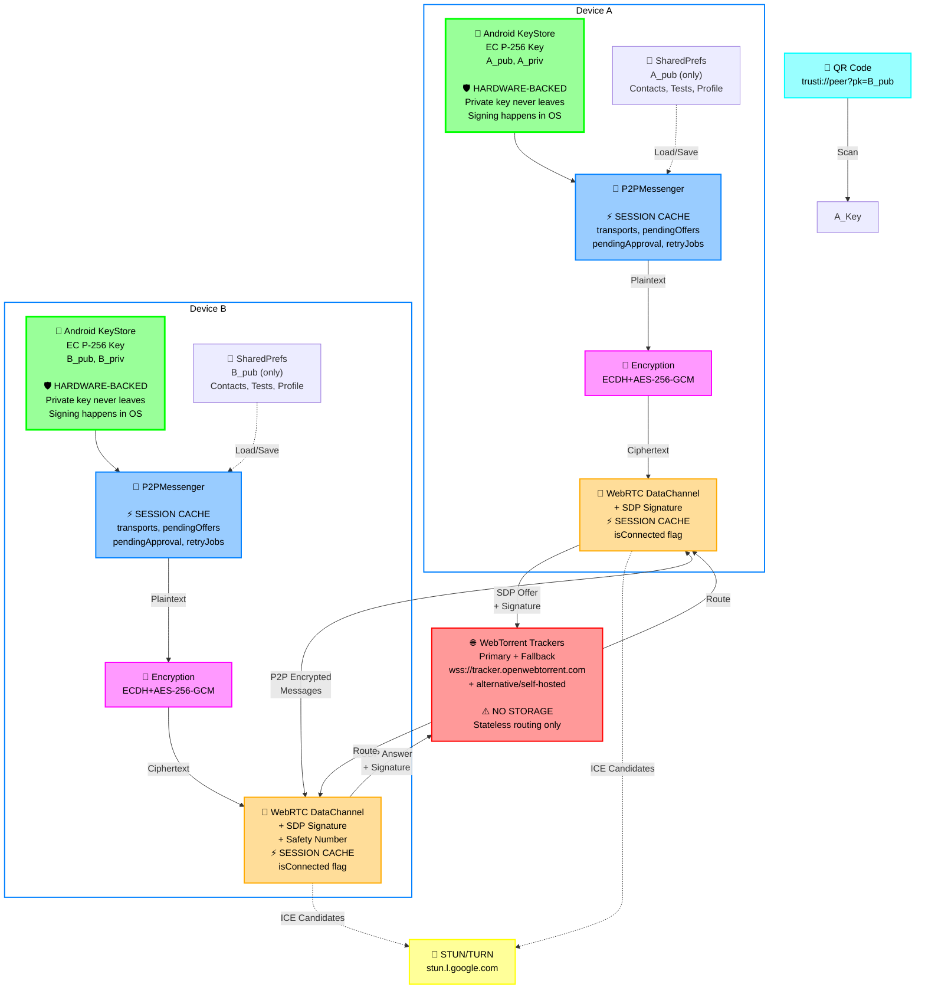

---

## Core Principles

1. **No central server:** Keys, encryption, messaging happen on-device or directly P2P
2. **Tracker = rendezvous only:** Routes SDP signaling; never stores/relays content
3. **One QR scan:** After first handshake, reconnects happen automatically via permanent room
4. **Ephemeral encryption:** Each message has its own key; past messages stay safe even if key stolen

---

## How It Works

### 1. Identity & Key Exchange

Every user has a permanent EC P-256 key pair generated on first launch and stored in SharedPreferences (`crypto/KeyManager.kt`). The public key is the user's identity — there is no account or server.

Adding a contact: scan their QR code. The QR encodes:
```
trusti://peer?pk=<BASE64URL_PUBKEY>
```

**QR Exchange Diagram:**
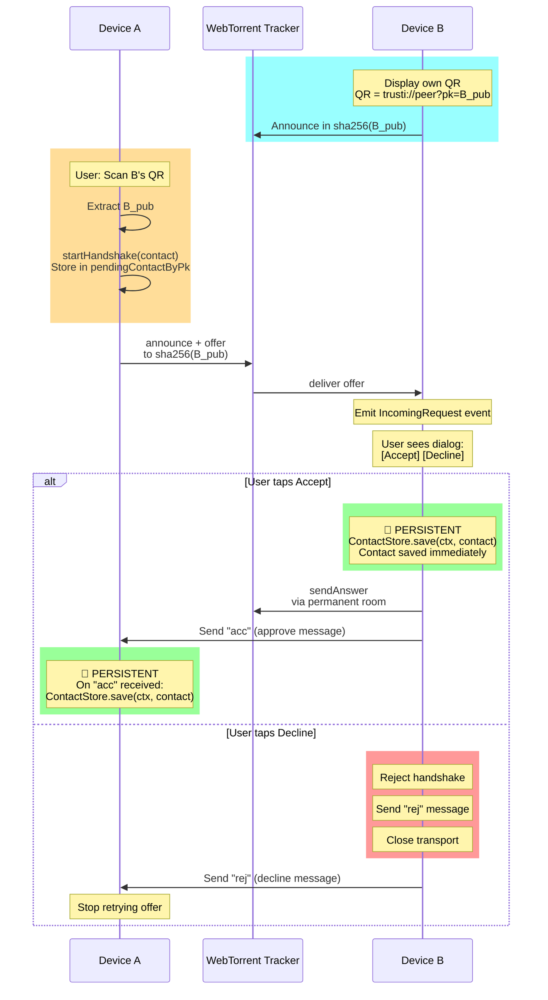

With B's public key (B_pub), A can:
- Derive permanent signaling room: `sha256(sorted(A_pub || B_pub))`
- Encrypt messages so only B can decrypt

**Contact Saving Lifecycle:**

| Event | Side | Action | Storage |
| --- | --- | --- | --- |
| User scans QR | A | Store contact in `pendingContactByPk`, send offer | ⚡ SESSION |
| Offer received | B | Show accept/decline dialog | ⚡ SESSION (transports, handledOffers) |
| User accepts | B | Save contact immediately, send "acc" | 💾 PERSISTENT (ContactStore) |
| "acc" received | A | Save contact from `pendingContactByPk` | 💾 PERSISTENT (ContactStore) |
| User declines | B | Send "rej", close transport | ❌ Contact never saved |
| "rej" received | A | Stop retries, remove from pending | ❌ Contact never saved |
| DataChannel opens | A/B | Mark `isConnected=true` (memory only) | ⚡ SESSION (resets on app restart) |

### 2. Signaling via WebTorrent Tracker

Peers discover and exchange signaling through a public WebTorrent tracker (`wss://tracker.openwebtorrent.com`). **The tracker routes only encrypted SDP offers/answers — never message content.**

**Room Types (all SHA-256 hashed):**

| Room Type | Key | Purpose |
| --- | --- | --- |
| **Personal** | `sha256(my_public_key)` | I listen here; new peers reach me after scanning my QR |
| **Permanent** | `sha256(sorted(A_pub \|\| B_pub))` | Both peers announce here; enables reconnection without scanning |

**Room Hashing:** Keys are concatenated lexicographically then hashed. Example: if A_pub < B_pub (byte comparison), then room = sha256(A_pub || B_pub). Both peers compute the same room ID independently.

#### First-Time Connection Flow (A scans B's QR)

**Two-phase bonding:**
- Phase 1: A sends offer, B shows dialog
- Phase 2: B user accepts → B saves contact → B sends "acc" → A saves contact

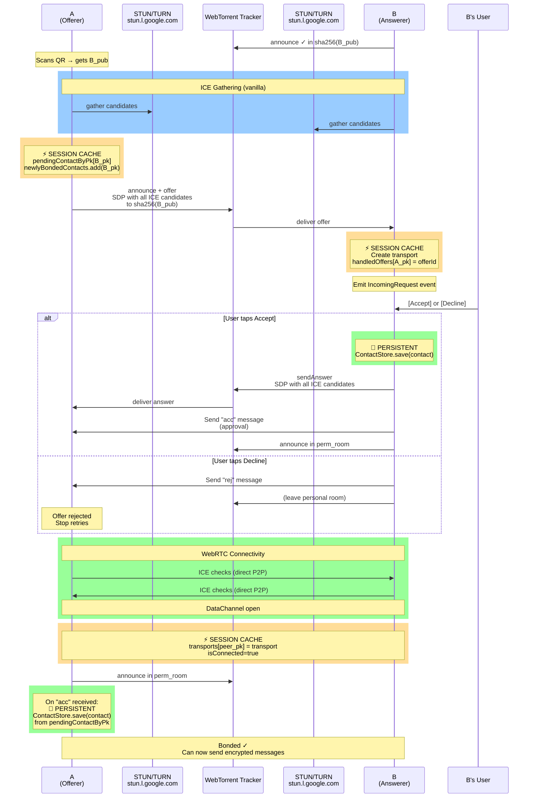

**Key point:** ICE candidates are bundled in the SDP (vanilla ICE), not trickled separately—required because the tracker only understands announce/answer messages.

**Answer routing:** B sends answer back on the **same room** where the offer came from:
- First-time (handshake): Offer → sha256(B_pub), Answer → sha256(B_pub)
- Reconnect (permanent): Offer → sha256(A_pub ∥ B_pub), Answer → sha256(A_pub ∥ B_pub)

**After bonding:** Both peers derive and announce in the permanent room. Reconnects happen without QR scanning.

#### Reconnection Flow (both peers have each other saved)

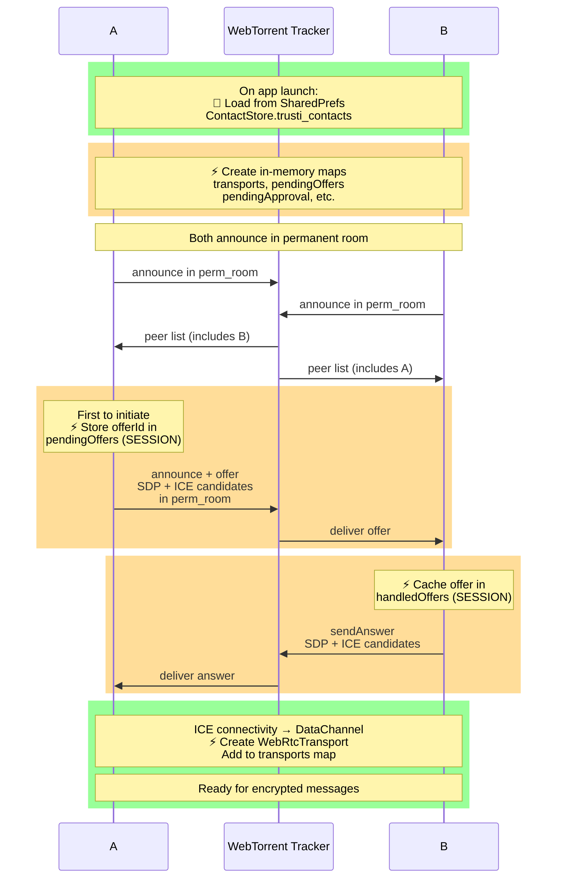

#### Participant Roles

**A (Offerer / Initiator):**
- Has B's public key (scanned QR or saved contact)
- Initiates handshake by creating WebRTC offer
- Gathers ICE candidates locally
- Sends offer + all candidates to tracker in one message

**Tracker (Rendezvous Point):**
- Routes WebRTC signaling only—never sees plaintext
- Peers announce to enter a "room"
- Delivers offer/answer between A and B via announce protocol
- **No storage, no relay:** stateless routing

**B (Answerer / Listener):**
- Listens in personal room: `sha256(B_pub)`
- Receives A's offer from tracker
- Gathers own ICE candidates
- Sends answer + candidates back via tracker
- Both devices form direct DataChannel

#### Signaling Message Flow

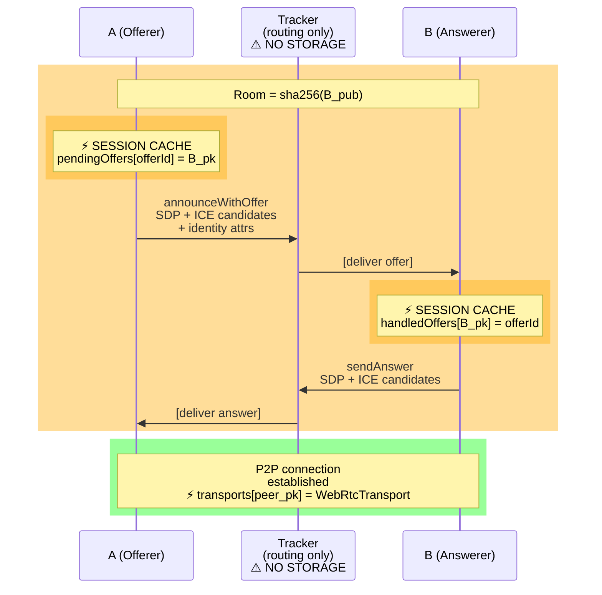

**Identity:** Public key + display name in SDP as `a=x-trusti-*` attributes—B knows who called without needing a server.

### 3. WebRTC Data Channel (Vanilla ICE)

Once signaling completes, a direct P2P encrypted channel opens between devices (`smp/WebRtcTransport.kt`).

**Vanilla ICE (Complete Mode):**
- All ICE candidates gathered **before** sending SDP
- Bundled into offer/answer at once
- **Why:** WebTorrent tracker only understands announce/answer protocol, not trickle ICE messages

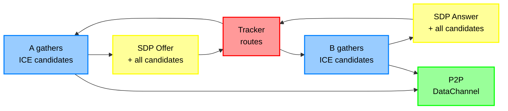

**NAT Traversal:**
- Google STUN servers: public IP + port discovery
- OpenRelay TURN: fallback for symmetric NAT (bandwidth relay)

**Auto-initiate:** If offline when message sent, handshake triggers automatically; message queued and delivered on open.

### 4. End-to-End Encryption

Every message is encrypted **before** handing to WebRTC. Even if captured, content is unreadable without the recipient's private key.

**Algorithm: ECDH (ephemeral) + AES-256-GCM** (`smp/Encryption.kt`)

**Sender (A) encrypts for recipient (B):**
```
plaintext → [gen ephemeral key pair]
         → [ECDH: ephemeral_priv XOR B_pub]
         → [derive AES-256 key via SHA-256]
         → [gen random 12-byte IV]
         → [AES-256-GCM encrypt + auth tag]
         → wire format: [ephPubLen|ephPubDER|IV|ciphertext|tag]
```

**Recipient (B) decrypts:**
```
wire format → [parse ephemeral_pub, IV, ciphertext]
           → [ECDH: B_priv XOR ephemeral_pub]
           → [derive same AES-256 key via SHA-256]
           → [AES-256-GCM decrypt + verify auth tag]
           → plaintext (or ❌ fail if tampered)
```

**Ephemeral key per message:** No long-term shared secret; no key reuse. Past messages stay safe even if long-term key is compromised (forward secrecy).

### 5. Message Types

All messages are JSON (then encrypted). Sent over the DataChannel after bonding is complete.

#### User-Facing Messages

| Type | Payload | Purpose | Direction |
| --- | --- | --- | --- |
| `text` | `{from, content, ts}` | Chat message | Bidirectional |
| `sreq` | `{"t": "sreq"}` | **Status Request:** "What's your latest test result?" | A → B |
| `srsp` | `{"t": "srsp", "pos": boolean}` | **Status Response:** "I have/don't have a positive test" | B → A |

**Example flow:**
1. A opens contact → sends `sreq`
2. B receives `sreq` → reads `TestsStore` (current test results)
3. B sends `srsp` with boolean flag indicating positive test
4. A receives `srsp` → updates UI with B's current status
5. If B is offline, A queues the update in `PendingStatusStore` (expires after 7 days)

#### Internal Protocol Messages (Bonding & Lifecycle)

| Type | Payload | Purpose | When |
| --- | --- | --- | --- |
| `acc` | `{"t": "acc"}` | **Accept:** B approves the bond, contact is now saved | B sends when user taps "Accept" |
| `rej` | `{"t": "rej"}` | **Reject:** B declines the bond request, A should stop retrying | B sends when user taps "Decline" |
| `bye` | `{"t": "bye"}` | **Goodbye:** Peer is removing the bond, please delete me too | Either side sends when removing contact |

**Bond lifecycle:**
1. A scans QR → creates offer (no message yet—offer via tracker)
2. B receives offer → shows dialog
3. B user accepts → B sends `acc` → A receives `acc` → A saves contact
4. (Alternatively) B user declines → B sends `rej` → A stops retrying, bond fails
5. Later, user removes contact → sends `bye` → peer deletes bond too

**Key insight:** `acc`/`rej`/`bye` are internal protocol messages that happen AFTER the DataChannel is open, unlike the SDP offer/answer which travel through the tracker during handshake.

---

## Storage and Caching

### Persistent storage (survives process death)

All persistent state lives in Android `SharedPreferences` as JSON strings — no database, no files.

| Store                | Prefs key               | Contents                                                          | Notes                                                                           |
| -------              | -----------             | ----------                                                        | -------                                                                         |
| `KeyManager`         | `trusti_keys`           | EC P-256 key pair (DER-encoded)                                   | Generated once on first launch; never leaves the device                         |
| `ContactStore`       | `trusti_contacts`       | List of up to 50 contacts (name, public key, last disease status) | `isConnected` is always written as `false` — it is a runtime-only flag          |
| `TestsStore`         | `trusti_tests`          | Medical records (disease, date, POSITIVE / NEGATIVE)              | Read on every incoming `sreq` to compute the current positive flag              |
| `PendingStatusStore` | `trusti_pending_status` | One queued status update per offline contact                      | Entries expire after 7 days; consumed atomically when the contact next connects |
| `ProfileManager`     | `trusti_profile`        | Display name + disambiguation suffix                              | Set once during onboarding                                                      |

### In-session state (cleared on process death)

`P2PMessenger` is a process-lifetime singleton. The following maps live purely in memory and are rebuilt from scratch on every app launch:

| Field                      | Type                                     | Purpose                                                                                              |
| -------                    | ------                                   | ---------                                                                                            |
| `transports`               | `ConcurrentHashMap<pk, WebRtcTransport>` | One active DataChannel per connected peer                                                            |
| `pendingOffers`            | `ConcurrentHashMap<offerId, pk>`         | Tracks offers A sent so incoming answers can be matched                                              |
| `pendingApproval`          | `Set<pk>`                                | Peers whose incoming-request dialog has not been answered yet                                        |
| `pendingHandshakes`        | `Queue<Contact>`                         | Handshakes queued before the tracker WebSocket connected                                             |
| `retryJobs`                | `ConcurrentHashMap<pk, Job>`             | Active offer-retry coroutines (re-announce every 5 s, up to 6 times)                                 |
| `newlyBondedContacts`      | `Set<pk>`                                | Peers that bonded in this session — drives the "new bond" confirmation dialog                        |
| `handledOffers`            | `ConcurrentHashMap<pk, offerId>`         | Dedup cache: the last offer ID processed per peer; capped at 100 entries to prevent unbounded growth |
| `pendingAccepts`           | `Set<pk>`                                | B-side: approved contacts waiting for the DataChannel to open before sending `acc`                   |
| `isConnected` on `Contact` | `Boolean`                                | Set to `true` in memory when a transport opens; always `false` when loaded from disk                 |

### Startup Sequence

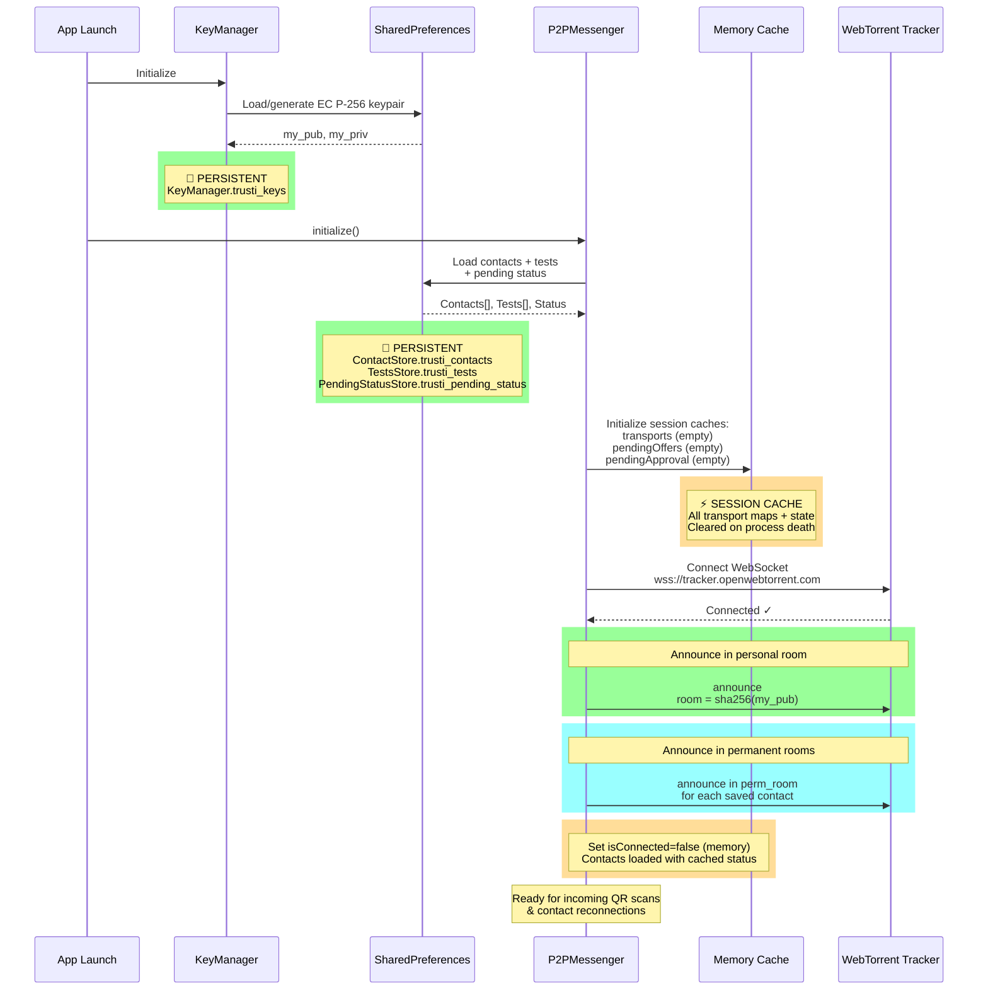

**State after startup:**
- All contacts have `isConnected = false` (memory only)
- Personal room active → can receive incoming scans
- Permanent rooms active → can receive peer announcements for existing bonds

### Pending status delivery

When a test result changes and a contact is offline, the latest status is written to `PendingStatusStore`. The existing entry for that contact is replaced (not appended), so only the most recent status is ever queued. When the contact's DataChannel opens, `deliverPendingStatus()` atomically reads and removes the entry, then sends it over the encrypted channel.

---

## Privacy Properties

**What the tracker sees:**
- Hashed room IDs (sha256 values—cannot be reversed)
- SDP offer/answer (connection handshake only—no content)
- Peer announcements (time + room—no metadata)

**What the tracker does NOT see:**
- Message content (encrypted end-to-end)
- Real identities (only public key hashes)
- Contact relationships (different per pair)
- Test results, health data, anything about users

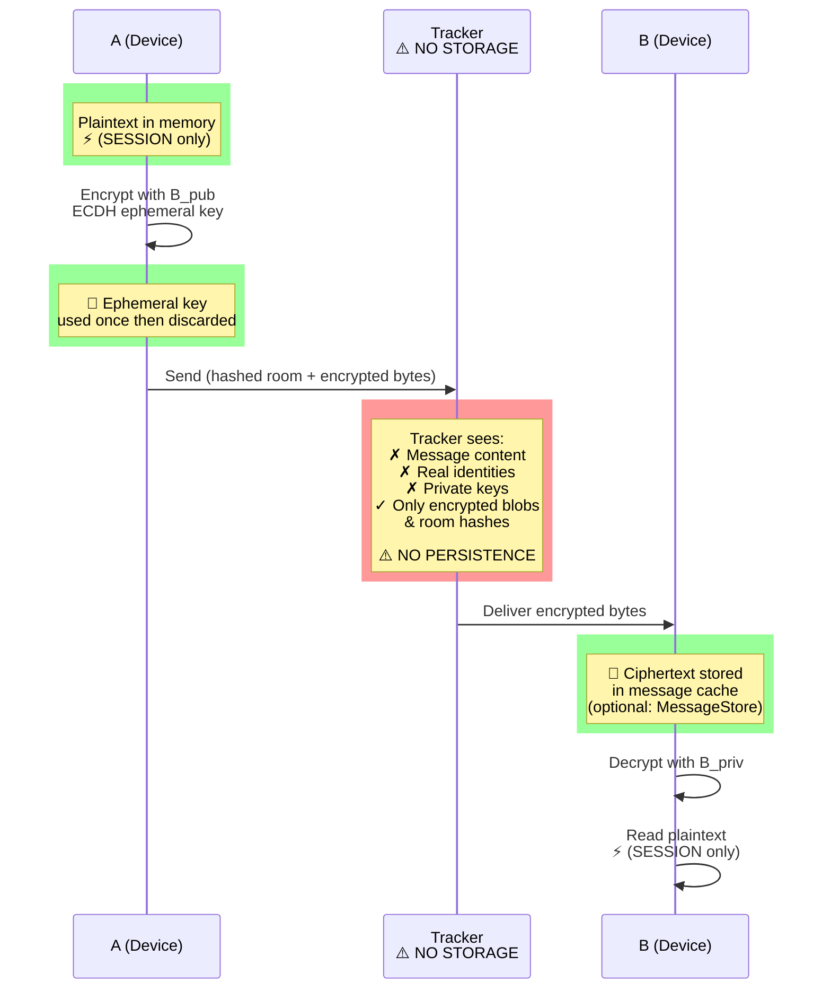

| Property | How achieved |
| --- | --- |
| **No server stores messages** | End-to-end encrypted; only encrypted bytes route through tracker |
| **No server knows identity** | Keys generated locally; tracker sees only room hashes |
| **Forward secrecy** | Ephemeral key per message—past intercepts unreadable even if long-term key stolen |
| **Authenticated encryption** | AES-GCM tag; tampering detected immediately (fail-safe) |
| **Contact privacy** | Different room per pair; tracker can't link contacts together |

---

## Error Handling & Recovery

**Tracker Disconnect (Mid-Session)**

| Scenario | Behavior | Recovery |
| --- | --- | --- |
| **Tracker unreachable on startup** | Emit `TrackerError` event, do not block app initialization | Retry with exponential backoff (1s, 2s, 4s, 8s, max 60s); failover to secondary tracker if configured |
| **Tracker drops mid-session** | All pending offers marked stale; WebSocket reconnect triggered | Reannounce in rooms on reconnect; resend pending offers with new IDs; clear `pendingOffers` map on 60s timeout |
| **Tracker timeout (>30s without pong)** | Close WebSocket, treat as disconnect | Immediate failover to secondary tracker; do not wait for exponential backoff |

**ICE Candidate Gathering Failure**

| Scenario | Behavior | Recovery |
| --- | --- | --- |
| **STUN/TURN unreachable** | No host candidates; only relay candidates gathered | Attempt to send offer with partial candidates (may still connect via relay); fail after 10s timeout if no candidates at all |
| **NAT traversal impossible** | ICE checks fail; no P2P connection formed | Emit `IceConnectionFailed` event; keep DataChannel in CONNECTING state for 30s then close; user sees "Cannot reach {contact}" |
| **ICE candidate timeout** | No candidates gathered after 10s; complete flag set | Send offer/answer with whatever candidates exist; may result in connection failure but do not block indefinitely |

**Message Delivery Race Conditions**

| Scenario | Problem | Resolution |
| --- | --- | --- |
| **"acc" lost; A-side saved contact before receiving** | A thinks bond is confirmed, but B never saw "acc" arriving, so B rejects on next interaction | A retries offer automatically (max 6 times, 5s apart); if B still rejects, A receives `RequestRejected` event and clears contact |
| **DataChannel opens but "acc" not sent yet** | Message buffer fills; "acc" arrives out of order with other messages | Mark "acc" as priority; send before any buffered messages; if DataChannel closes before "acc" arrives, retry on reconnect |
| **B receives offer, accepts, but DataChannel never opens** | Contact saved on both sides but connection fails; both think they're bonded but can't message | Detect timeout on first message send (>30s); emit `ConnectionFailed` event; user can manually retry or remove and re-add contact |

**Error Event Contract:**
```kotlin
sealed class P2PEvent {
    data class TrackerError(val exception: Exception, val retryCount: Int)
    data class IceConnectionFailed(val contact: Contact, val reason: String)
    data class DataChannelError(val contact: Contact, val exception: Exception)
    data class MessageDeliveryFailed(val contact: Contact, val messageId: String)
    data class ContactUnreachable(val contact: Contact)  // Emitted after 5min RECONNECTING timeout
    // ... other events
}
```

---

## P2PMessenger State Machine

**Connection Lifecycle States per Peer:**

```
┌─────────────────────────────────────────────────────────────────┐
│  IDLE (no contact saved)                                        │
│  • No transport exists                                          │
│  • No pending state                                             │
│  • Events: [startHandshake → OFFERING]                          │
└─────────────────────────────────────────────────────────────────┘
              ↑
              │ closeContact()
              │
┌─────────────────────────────────────────────────────────────────┐
│  OFFERING (A: sent offer, waiting for answer)                   │
│  • pendingOffers[offerId] = contact.pk                          │
│  • retryJob active (5s interval, max 6 retries)                 │
│  • Events: [answer → CONNECTING] [rej → IDLE] [timeout → IDLE] │
└─────────────────────────────────────────────────────────────────┘
              ↓
┌─────────────────────────────────────────────────────────────────┐
│  ANSWERING (B: received offer, waiting for user decision)       │
│  • handledOffers[contact.pk] = offerId                          │
│  • pendingApproval.contains(contact.pk)                         │
│  • Events: [accept → ACCEPTING] [reject → IDLE]                │
└─────────────────────────────────────────────────────────────────┘
              ↓
┌─────────────────────────────────────────────────────────────────┐
│  ACCEPTING (B: user accepted, sending answer SDP)               │
│  • transport created & answer sent                              │
│  • pendingAccepts.contains(contact.pk)                          │
│  • Events: [DataChannel.onOpen → CONNECTED] [error → IDLE]     │
└─────────────────────────────────────────────────────────────────┘
              ↓
┌─────────────────────────────────────────────────────────────────┐
│  CONNECTING (both: ICE connectivity checks in progress)         │
│  • transport.state = CONNECTING                                 │
│  • No messages sent/received yet                                │
│  • Timeout: 30s, then fail to IDLE                              │
│  • Events: [DataChannel.onOpen → CONNECTED] [error → IDLE]     │
└─────────────────────────────────────────────────────────────────┘
              ↓
┌─────────────────────────────────────────────────────────────────┐
│  CONNECTED (both: DataChannel open, can exchange messages)      │
│  • transport.state = OPEN                                       │
│  • isConnected = true (memory-only flag)                        │
│  • Can send/recv text, sreq, srsp, acc, rej, bye, etc.         │
│  • Periodic keepalive: every 30s (empty message)                │
│  • Events: [message → process] [bye → CLOSING] [disconnect → RECONNECTING] │
└─────────────────────────────────────────────────────────────────┘
      ↓              ↑
      │              │ (reconnect within 60s)
      │ (>60s idle)  │
┌─────────────────────────────────────────────────────────────────┐
│  RECONNECTING (peer went offline, auto-retry)                   │
│  • transport closed but contact still saved                     │
│  • Announce in permanent room; wait for peer to answer          │
│  • Retry timeout: 5 min of silence, then give up                │
│  • Events: [answer → CONNECTING → CONNECTED] [timeout → emit   │
│             ContactUnreachable event, then IDLE]                │
└─────────────────────────────────────────────────────────────────┘
              ↓
┌─────────────────────────────────────────────────────────────────┐
│  CLOSING (peer sent "bye", removing contact)                    │
│  • Send "bye" message (if transport open)                       │
│  • Clear transport + pending state                              │
│  • Remove from permanent room                                   │
│  • Events: [complete → IDLE]                                    │
└─────────────────────────────────────────────────────────────────┘
              ↓ (auto-transition)
           IDLE
```

**Activity/Service Lifecycle Integration:**

| Android State | P2PMessenger Behavior |
| --- | --- |
| **onCreate()** | initialize() called; loads contacts; connects to tracker; announces in rooms |
| **onResume()** (app enters foreground) | Resume all pending handshakes; accelerate reconnection retries (1s instead of 5s) |
| **onPause()** (app goes to background) | No change to active connections; continue announcing in rooms |
| **Doze/App Standby** | Tracker WebSocket may be killed by OS; on app wake, reconnect triggered; pending messages queued |
| **onDestroy()** (app killed) | WebSocket closed; all transports closed; session cache wiped; persistent state (contacts, tests) survives |

**Background Restrictions (Android 8+):**
- App cannot wake itself or access network in background after 15 min idle
- Incoming peer offers are **not** received if app is background for >1 min
- **Mitigation:** Use WorkManager to periodically refresh tracker connection every 10 min (if app is backgrounded); re-announce in rooms on app resume

---

## Threading & Concurrency Model

**Thread Ownership:**

| Component | Thread | Ownership | Mutability |
| --- | --- | --- | --- |
| `P2PMessenger` singleton | Main + Coroutine IO scope | Single instance, lazy initialized on MainThread | Immutable reference |
| `peerEventFlow` | Flow consumer (UI, typically Main) | Coroutine scope provided by collector | Collect on UI thread, emit on IO thread |
| `transports` map | IO scope (WebSocket + ICE) | Accessed from tracker WS callbacks + ICE callbacks | ConcurrentHashMap (thread-safe reads) |
| `pendingOffers` map | IO scope | Accessed from tracker WS thread on answer arrival | ConcurrentHashMap (atomic operations) |
| `retryJobs` map | Main (via coroutine scheduler) | Job objects scheduled on DefaultDispatcher | ConcurrentHashMap |
| WebSocket (`TorrentSignaling`) | IO scope (OkHttp) | Single connection, managed by `TorrentSignaling` | Immutable channel to tracker |

**Coroutine Scope Structure:**

```
// Global scope (app lifetime)
object P2PMessenger {
    private val scope: CoroutineScope = CoroutineScope(Dispatchers.IO + Job())

    // Per-contact handshake (store jobs for cancellation)
    private val retryJobs: Map[String, Job] = ConcurrentHashMap()

    fun startHandshake(contact: Contact) {
        val job = scope.launch {
            // Announce offer, retry every 5s up to 6 times
            repeat(6) {
                announceOffer()
                delay(5000)
            }
        }
        retryJobs[contact.pk] = job
    }

    // Event emission (safe to collect from Main thread)
    private val _peerEventFlow: Flow[PeerEvent] = MutableSharedFlow()
    val peerEventFlow: Flow[PeerEvent] = _peerEventFlow.asSharedFlow()

    // Safe cross-thread emission (suspends on backpressure)
    private suspend fun emit(event: PeerEvent) {
        _peerEventFlow.emit(event)
    }
}
```

**Race Condition Mitigations:**

| Race | Problem | Solution |
| --- | --- | --- |
| **Handshake + app kill** | Pending offer cleared before answer arrives on restart | On startup, reload contacts but don't re-announce; wait 10s for peer answer in permanent room |
| **Dual offer (A & B both initiate)** | Both send offers simultaneously; duplicate transports | Compare public keys lexicographically; lower PK initiates; higher PK only answers; singleton transport per peer |
| **Message send + disconnect** | Message queued in DataChannel, channel closes, message lost | Queue messages in memory until `isConnected=true`; retry on reconnect (max 24h expiry) |
| **Shutdown + pending retry job** | Job tries to access closed WebSocket | Cancel all retryJobs in scope.cancel() before closing WebSocket |

---

## Message Serialization & Wire Format

**JSON Schema (v1):**

All messages exchanged over the encrypted DataChannel are JSON objects with a `t` (type) field:

**Message Types:**

| Type | Required Fields | Example |
| --- | --- | --- |
| `text` | `from` (string), `content` (string, max 10k chars), `ts` (unix ms) | `{t:"text", from:"Alice", content:"Hi", ts:1234567890}` |
| `sreq` | (none) | `{t:"sreq"}` |
| `srsp` | `pos` (boolean) | `{t:"srsp", pos:true}` |
| `acc` | (none) | `{t:"acc"}` |
| `rej` | (none) | `{t:"rej"}` |
| `bye` | (none) | `{t:"bye"}` |
| `key_rotation` | `old_pk` (BASE64URL), `new_pk` (BASE64URL), `sig` (BASE64) | `{t:"key_rotation", old_pk:"...", new_pk:"...", sig:"..."}` |
| `revoke_bond` | `reason` (compromised\|device_lost\|other) | `{t:"revoke_bond", reason:"compromised"}` |

**Wire Format (Encrypted):**

```
[Encryption header: 2-byte keyLen]
[DER ephemeral pubkey: keyLen bytes]
[IV: 12 bytes]
[JSON payload: variable]
[GCM tag: 16 bytes]
```

**Versioning:**
- No explicit version field; backward compatibility maintained by optional fields only
- **Future versions:** Add `v: 2` field if incompatible changes needed
- **Migration:** Old clients reject messages with unknown `t` values; new clients ignore unknown fields

**Size Limits:**
- Max message size: 65 KB (after encryption)
- Max text content: 10,000 characters
- Max pending messages per contact: 1,000 (FIFO drop oldest if exceeded)

---

## Security & Privacy Issues

This section documents known security and privacy issues, their severity, and planned mitigations. These are intentionally transparent trade-offs rather than hidden bugs.

### 1. Private Keys in SharedPreferences ⚠️ **HIGH SEVERITY**

**Issue:**
EC P-256 private keys are generated at runtime and persisted as JSON strings in Android `SharedPreferences`. On a non-encrypted device or with root access, any process can read the raw SharedPreferences database file (`/data/data/com.davv.trusti/shared_prefs/trusti_keys.xml`) and extract the private key in plaintext.

**Impact:**
- Complete compromise of the user's identity and all past messages if device is stolen
- No hardware security module protection
- Forward secrecy does not protect past messages if the device is compromised *after* the fact

**Current Status:**
Keys are stored in `crypto/KeyManager.kt` as DER-encoded strings. This is safe enough for the MVP but must be upgraded for production.

**Mitigation:**
Use Android `KeyStore` (available on API 23+, minSdk is 26):
- Generate and store private keys in the OS-level KeyStore (hardware-backed on API 30+)
- Private keys never leave the Keystore; sign/ECDH operations happen inside the Keystore
- Only public keys are readable from SharedPreferences
- Implementation: Refactor `KeyManager` to use `KeyPairGenerator` with `AndroidKeyStore` provider
- Timeline: Required before production release

**Affected Files:**
- `crypto/KeyManager.kt` (generate/load logic)
- `smp/Encryption.kt` (ECDH, decrypt)
- `smp/WebRtcTransport.kt` (SDP signing—see issue #2)

---

### 2. Unauthenticated SDP Identity Attributes ⚠️ **HIGH SEVERITY**

**Issue:**
During the handshake, A sends an offer with `x-trusti-pk` and `x-trusti-name` SDP attributes (plus optional name + disambiguation). These attributes are **not signed or authenticated**. A malicious tracker operator (or MITM at the tracker layer) can rewrite these attributes to impersonate a different peer.

**Attack scenario:**
1. A scans a QR code displaying B's public key
2. A sends an offer to B's personal room with A's identity in SDP attributes
3. Attacker intercepts the offer at the tracker and replaces `x-trusti-pk` with Attacker's key
4. B receives the offer and sees "Attacker" is calling, not "A"
5. B user accepts the bond thinking they are bonding with A, but they are bonded with Attacker

**Current Status:**
No SDP signing is implemented. After the DataChannel opens and `acc`/`rej` messages flow, the identity is implicitly confirmed (because B knows who they accepted), but during the initial handshake there is a brief window of vulnerability.

**Mitigation:**
Sign the SDP offer (or at minimum, the public key + a nonce) with A's private key, so B can verify using the scanned A_pub:
- A computes a signature over `sha256(offer SDP)` using private key
- A includes the signature in an SDP attribute: `a=x-trusti-sig:<BASE64_SIG>`
- B receives offer, verifies signature using the scanned public key
- If signature fails, reject the offer and warn the user
- Implementation: Add signature generation in `WebRtcTransport.createOffer()`, verification in `WebRtcTransport.handleOffer()`, requires private key signing capability (see issue #1)
- Timeline: Required before production release

**Affected Files:**
- `smp/WebRtcTransport.kt` (createOffer, handleOffer)
- `crypto/KeyManager.kt` (signing capability)

---

### 3. QR Code Exchange Lacks TOFU / Display Verification ⚠️ **MEDIUM SEVERITY**

**Issue:**
The QR code itself contains only B's public key. There is no verification step after scanning to ensure that:
1. The scanned QR was actually displayed by B (not intercepted via shoulder-surfing or screenshot)
2. The person showing the QR is actually the person you think they are (no identity binding)

**Attack scenario:**
1. Attacker shoulder-surfs and records B's QR code
2. Attacker scans the QR with their own device, bonding as "B" from Attacker's perspective
3. Attacker then presents themselves to Alice as "Bob" in person, but the QR bonds with the Attacker's device instead

**Current Status:**
No out-of-band verification (e.g., short safety numbers) is implemented. After bonding and messaging, users will naturally verify identities through conversation, but the initial handshake has no anti-phishing step.

**Mitigation (Post-MVP):**
Implement TOFU (Trust On First Use) with display verification:
- After scanning QR and receiving the offer, show a **short safety number** (e.g., first 6 chars of `sha256(sorted(A_pub || B_pub))` in hex)
- Display the same safety number on both devices during the handshake
- User reads the safety number aloud or confirms visually before accepting
- This prevents MITM attacks and ties the QR scan to a specific physical interaction
- Implementation: Add UI dialog during `IncomingRequest` to display safety number
- Timeline: Post-MVP (good-to-have for security, not blocking initial release)

**Safety Number Verification Flow:**
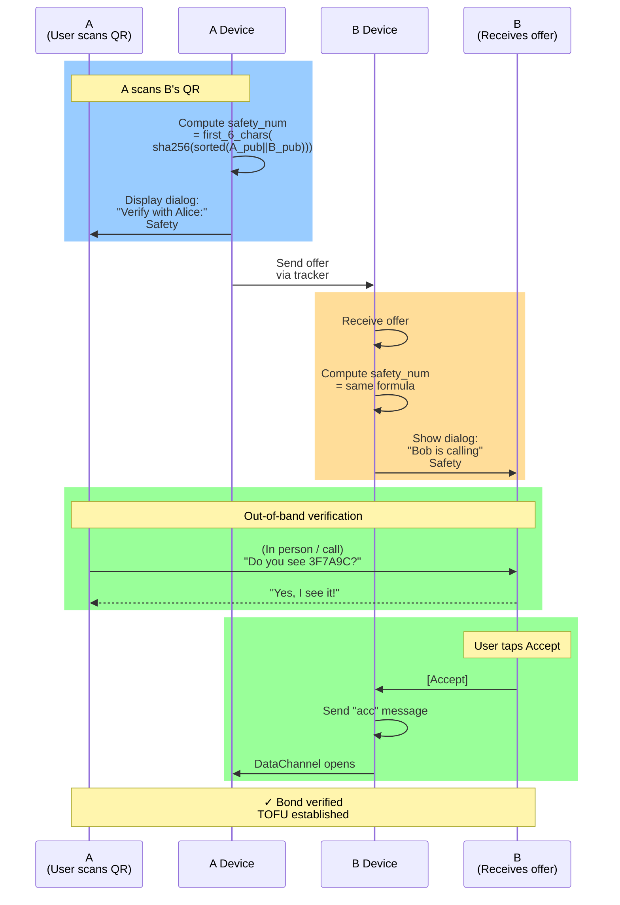

---

### 4. No Key Rotation or Bond Revocation Mechanism ⚠️ **MEDIUM SEVERITY**

**Issue:**
- If a device is lost, compromised, or the user's key is accidentally exposed, there is no documented mechanism to rotate keys or revoke bonds
- All contacts remain bonded with the compromised key
- Users cannot remotely revoke access to their health data from a lost device
- The old device retains all contact data and can continue sending messages as the compromised identity

**Current Status:**
No key rotation or revocation is implemented. The only option is to delete the app and start over with a new device, manually re-scanning QR codes with all contacts.

**Mitigation (Post-MVP):**
Implement key rotation and optional bond revocation:
- **Key rotation:** User can initiate "rotate keys" → generates new key pair → stores in KeyStore → sends "key_rotation" message to all bonded contacts → all contacts update the stored public key
- **Bond revocation:** Contacts can send "revoke_bond" to all bonded peers to explicitly deny access from a specific public key
- Implementation: Add new message types in P2PMessenger, update ContactStore to version the public key
- Timeline: Recommended before any public release

**Key Rotation Flow:**
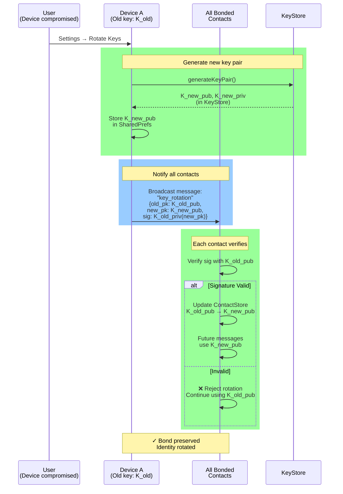

---

### 5. WebTorrent Tracker Dependency with No Fallback ⚠️ **LOW SEVERITY (SPECULATIVE)**

**Issue:**
The app relies on a single public WebTorrent tracker (`wss://tracker.openwebtorrent.com`) for signaling. If the tracker is down, offline, or censored:
- New handshakes cannot complete (no signaling channel)
- Existing contacts cannot reconnect
- The entire app becomes non-functional

While the tracker is generally reliable, depending on third-party infrastructure you do not control introduces a single point of failure for a privacy app.

**Current Status:**
The tracker is hardcoded in `smp/TorrentSignaling.kt`. There is no fallback mechanism, mirror, or self-hosted option.

**Mitigation (Post-MVP):**
Implement tracker resilience:
- **Multiple tracker support:** Allow connecting to multiple trackers (redundancy)
- **Self-hosted option:** Publish documentation for self-hosting a WebTorrent tracker; allow config override in app settings
- **Direct IP fallback:** For already-bonded contacts, attempt direct TCP connection to the peer's last-known IP (requires storing IP history)
- **Local network fallback:** If on the same local network, use mDNS or BLE discovery without tracker
- Implementation: Parameterize tracker URL, add tracker failover logic, optional IP backup discovery
- Timeline: Post-MVP (good for robustness, not blocking initial release)

**Multi-Tracker Failover Architecture:**
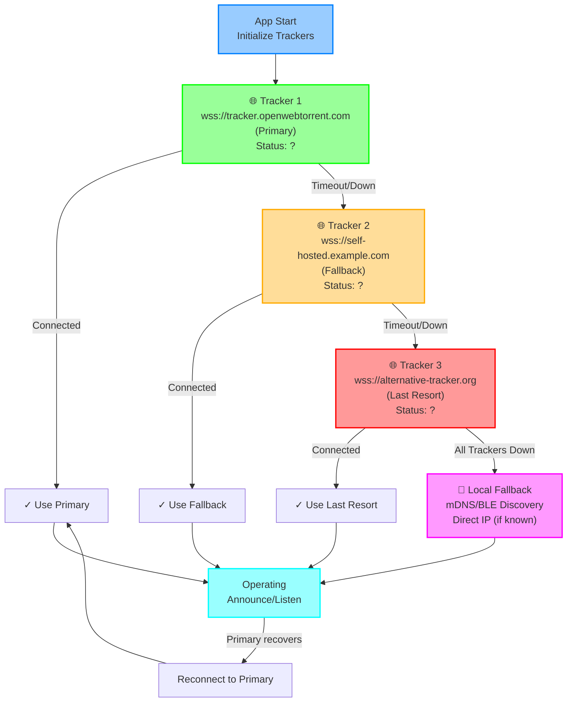

**Failover Decision Tree:**
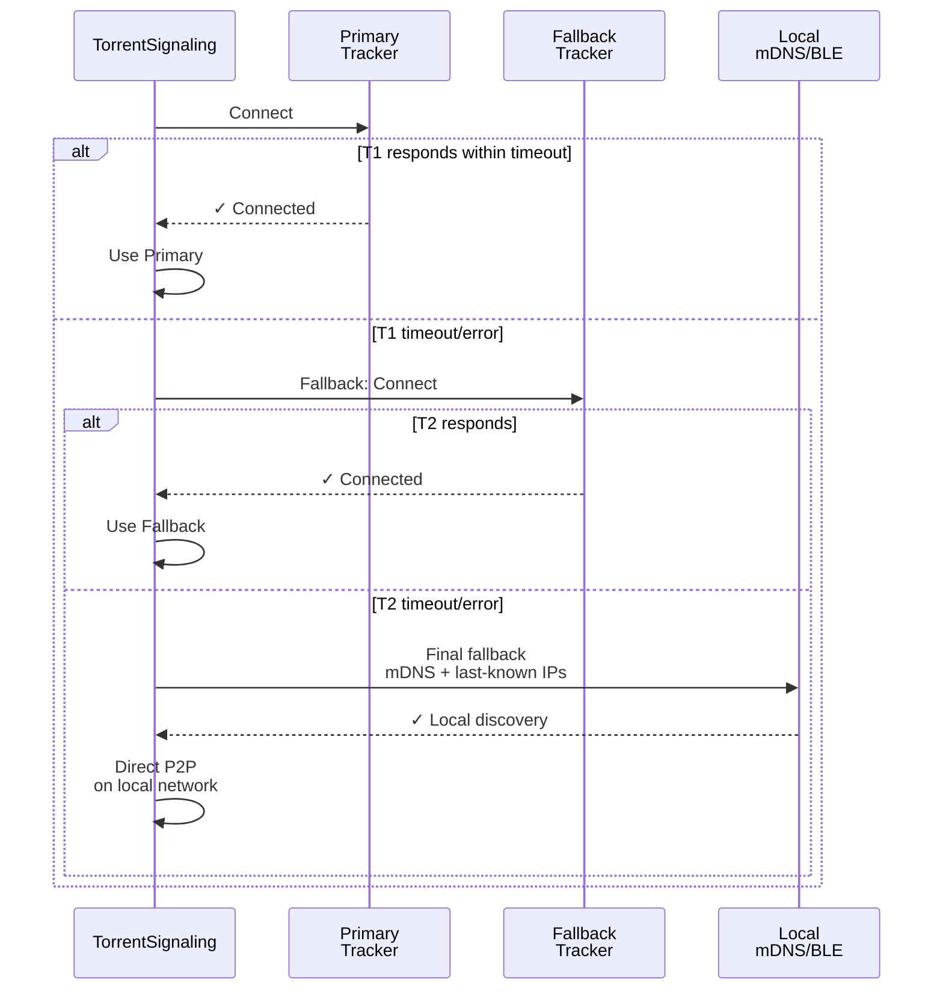

---

## Summary Table

| Issue | Severity | Category | Mitigation | Timeline |
| --- | --- | --- | --- | --- |
| Private keys in SharedPreferences | HIGH | Storage | Use Android KeyStore | Required before production |
| Unauthenticated SDP identity | HIGH | Handshake | Sign SDP with private key | Required before production |
| QR lacks TOFU verification | MEDIUM | Phishing | Add safety number verification | Post-MVP (good-to-have) |
| No key rotation / revocation | MEDIUM | Recovery | Implement key rotation message | Post-MVP (recommended) |
| Single tracker dependency | LOW | Reliability | Multi-tracker + self-hosted option | Post-MVP (robustness) |

---

## Common Usage Flows

### Flow 1: A Scans B's QR Code

```
A: Opens app → sees QR code camera
B: Displays own QR code

A: Points camera at B's QR → taps "Scan"
   ↓ (behind the scenes)
   A extracts B's public key
   A clears any stale session cache for this peer
   A sends WebRTC offer to B's personal room (retries every 5s)
   ↓
B: Receives A's offer (from tracker)
   B shows dialog: "Alice wants to connect. Accept? [Y/N]"
   ↓
A: If B accepts
   ↓ (hidden to user)
   B receives A's offer → creates answer → sends back via tracker
   A receives B's answer → DataChannel opens
   B sends "acc" message over encrypted channel
   A receives "acc" → saves B as contact permanently
   ↓
A and B: Connected ✓ Can now see each other's status
          (Send/receive test result status updates)

B: If B declines
   ↓ (hidden to user)
   B sends "rej" message
   A receives "rej" → stops retrying offer
   ↓
A and B: Not connected, bond rejected (can retry by scanning again)
```

### Flow 2: A Checks B's Test Status

```
A: Opens B's contact in app
   P2PMessenger sends "sreq" (status request)
   ↓
B: (if online)
   Receives "sreq"
   Reads local test results from disk
   Sends "srsp" with current positive/negative flag
   ↓
A: Receives "srsp" → updates UI showing B's status

B: (if offline)
   ↓
A: No response, so A queues the request in PendingStatusStore
   ↓
B: Comes back online → reconnects via permanent room
   ↓
A: Detects B is online → delivers queued status atomically
```

### Flow 3: A Removes B from Contacts

```
A: Opens contacts list → long-press on B → Delete
   ↓ (behind the scenes)
   A sends "bye" message to B (if connected)
   A clears entire session cache for B
   A removes from permanent room
   A deletes B from disk (ContactStore)
   ↓
B: (if online)
   Receives "bye" message
   B also deletes A from disk
   B removes from permanent room
   ↓
A and B: Bond is completely dissolved
          (if they want to reconnect, must scan QR again)
```

### Flow 4: Reconnection After App Restart

```
A: Kills app
   (All session cache wiped—transports, pending offers, etc.)

A: Opens app again
   ↓ (behind the scenes)
   App loads all saved contacts from disk
   Connects to tracker
   Announces in permanent room for each saved contact
   ↓
B: (also reopened app at the same time)
   Loads saved contacts
   Connects to tracker
   Announces in permanent room
   ↓
Tracker: Sees both A and B announcing in the same room
   ↓
A: (whoever initiates first based on lexicographic order of keys)
   Creates offer using permanent room
   Sends offer to tracker
   ↓
B: Receives offer → creates answer (no dialog this time—already saved)
   Sends answer via tracker
   ↓
A and B: DataChannel opens → immediately start syncing latest status
```

---

## Public API

### P2PMessenger (Main Singleton)

The `P2PMessenger` singleton orchestrates all peer-to-peer communication. Access via:
```kotlin
val messenger = P2PMessenger.get(context)
```

#### Key Functions

**`initialize()`**
- Initializes the messenger on app startup
- Loads your EC P-256 key pair (or generates it on first launch)
- Connects to WebTorrent tracker
- Loads saved contacts and rejoins permanent rooms
- Starts listening for incoming QR scans
```kotlin
// Call once on app launch
P2PMessenger.get(context).initialize()
```

**`startHandshake(contact: Contact)`**
- Called when user scans a QR code to add a new contact
- Stores contact in session cache (not persistent yet—pending B's approval)
- Clears any stale session state from previous attempts with this contact
- Creates and sends a WebRTC offer to B's personal room
- Retries offering every 5 seconds until B responds or user cancels
```kotlin
// User scanned QR → Device A initiates handshake
val contact = Contact(name = "Alice", publicKey = qrPublicKey)
messenger.startHandshake(contact)
```

**`approveIncomingRequest(contactPk: String)`**
- Called when B user taps "Accept" on the incoming request dialog
- Saves the contact permanently to device storage (ContactStore)
- Sends "acc" message to A once DataChannel is open
- Requests A's status (sends sreq message)
- Joins permanent room for future reconnections
```kotlin
// B user taps Accept on incoming request dialog
messenger.approveIncomingRequest(contactPublicKey)
```

**`rejectIncomingRequest(contactPk: String)`**
- Called when B user taps "Decline" on the incoming request dialog
- Sends "rej" message to A so A stops retrying
- Closes transport and clears all session cache for this contact
- Contact is never saved—the bond is rejected entirely
```kotlin
// B user taps Decline on incoming request dialog
messenger.rejectIncomingRequest(contactPublicKey)
```

**`closeContact(contactPk: String)`**
- Called when user removes a contact from their contact list
- Sends "bye" message to peer
- Clears all session cache (transport, pending offers, etc.)
- Removes from permanent room tracking
- Deletes pending queued status updates
```kotlin
// User taps Delete on contact in contacts list
messenger.closeContact(contactPublicKey)
```

**`peerEventFlow: SharedFlow<PeerEvent>`**
- Collect incoming events from peers (UI subscribes to this)
- Emitted events:
  - `ChannelOpened(contact, isNew)` → DataChannel is ready, can send/receive
  - `ChannelClosed(contact)` → Connection dropped
  - `IncomingRequest(contactPk, username, disambiguation)` → B received A's offer, show dialog
  - `StatusResponse(contactPk, hasPositive)` → Received test status from peer
  - `RequestRejected(contactPk)` → B declined the handshake attempt
  - `BondRemoved(contactPk)` → Peer sent "bye" message
```kotlin
// UI collects events to show dialogs and update UI
messenger.peerEventFlow.collect { event ->
    when (event) {
        is IncomingRequest -> showAcceptDeclineDialog(event.contactPk, event.username)
        is ChannelOpened -> updateContactStatus(event.contact, online = true)
        is ChannelClosed -> updateContactStatus(event.contact, online = false)
        // ... handle other events
    }
}
```

### Encryption

**`Encryption.encrypt(plaintext: ByteArray, recipientPublicKey: ByteArray): ByteArray`**
- Encrypts plaintext for a specific recipient
- Generates ephemeral EC P-256 key pair, performs ECDH with recipient's public key
- Derives 256-bit AES key via HKDF-SHA256
- Generates random 12-byte nonce, encrypts with AES-256-GCM
- Returns packed format: `[2-byte keyLen][ephemKey][nonce][ciphertext+tag]`
- Each message gets a fresh ephemeral key (forward secrecy)

**`Encryption.decrypt(data: ByteArray, privateKey: PrivateKey): ByteArray`**
- Decrypts ciphertext using recipient's private key
- Parses wire format to extract ephemeral public key, nonce, and ciphertext
- Performs ECDH with ephemeral public key to recover shared secret
- Derives same AES-256 key via HKDF-SHA256
- Decrypts and verifies GCM auth tag
- Throws `DecryptionException` if format is invalid or tag verification fails

### WebRtcTransport

**`createOffer()`**
- Initiator (A) side: creates WebRTC offer
- Gathers ICE candidates (vanilla ICE—all bundled in SDP)
- Sets local description and waits for ICE gathering to complete
- Once complete, invokes `onGatheringComplete` callback to send offer via tracker

**`handleOffer(sdp: String, offerId: String, fromPeerId: String)`**
- Answerer (B) side: receives offer from tracker
- Sets remote description (A's offer with ICE candidates)
- Creates answer, sets local description
- Waits for ICE gathering, then invokes `onGatheringComplete` to send answer via tracker

**`handleAnswer(sdp: String)`**
- Initiator (A) side: receives answer from tracker
- Sets remote description (B's answer)
- ICE connectivity checks begin, DataChannel opens once connection succeeds

### TorrentSignaling

**`announce(roomId: String)`**
- Join a room (listen for incoming offers)
- Used by answerer (B) on personal room, or both peers on permanent room

**`announceWithOffer(roomId, offerId, sdp, myPk, sig, myUsername, myDisambig)`**
- Send offer into a room
- Used by initiator (A) to send offer to B's personal room or permanent room

**`sendAnswer(roomId, toPeerId, offerId, sdp)`**
- Send answer back to offerer
- Used by answerer (B) to respond to A's offer

### ContactStore & TestsStore

**`ContactStore.save(ctx, contact: Contact)`**
- Persist a contact to SharedPreferences (JSON list)
- Called after B approves or A receives "acc"

**`ContactStore.load(ctx): List<Contact>`**
- Load all saved contacts from SharedPreferences on app startup

**`TestsStore.load(ctx): List<MedicalRecord>`**
- Load all saved medical test records
- Used when computing hasPositive flag for status responses

---

## Project Structure

```
app/src/main/java/com/davv/trusti/
├── crypto/
│   └── KeyManager.kt          EC P-256 key pair generation and storage
├── connection/
│   └── QrHelper.kt            QR generation and PeerInfo parsing
├── model/
│   ├── Contact.kt             name, publicKey, lastSeen
│   ├── Message.kt             chat message
│   └── MedicalRecord.kt       test result (disease, date, POSITIVE/NEGATIVE)
├── smp/
│   ├── Encryption.kt          ECDH + AES-256-GCM encrypt/decrypt
│   ├── TorrentSignaling.kt    WebTorrent tracker WebSocket client
│   ├── WebRtcTransport.kt     RTCPeerConnection + DataChannel per contact
│   └── P2PMessenger.kt        Singleton orchestrating signaling, transport, encryption
├── utils/
│   ├── ContactStore.kt        JSON persistence for contacts
│   ├── MessageStore.kt        Per-contact message persistence
│   ├── MedicalStore.kt        JSON persistence for medical records
│   ├── PendingStatusStore.kt  Queued status updates for offline contacts
│   └── ProfileManager.kt      Display name + disambiguation (adjective-noun)
└── ui/
    ├── CommonComponents.kt
    ├── DiseaseTestResult.kt   Disease row with +/−/? chips
    └── DiseaseTestList.kt     List of diseases with results
```

---

## User Features

### QR Code Display
- **Tap the QR code** to see its contents and explanation
- Shows your public key, username, and disambiguation
- Copy button to share the QR URI via text/email
- Explains what each field does and how bonding works

The QR code contains (in URI format):
```
trusti://peer?pk=<BASE64URL_PUBKEY>&u=<USERNAME>&d=<DISAMBIGUATION>
```

---

## Implementation Notes & Constraints

### Issue #1: RECONNECTING Silent Gap (RESOLVED via ContactUnreachable event)

**Problem:** After 5 minutes of retry timeout in RECONNECTING state, the connection would transition to IDLE with no user feedback. The contact remains saved but the UI has no way to show it's unreachable.

**Resolution:** Emit `ContactUnreachable(contact)` event when RECONNECTING times out. UI can then:
- Stop showing a stale "online" badge
- Display "last seen" time instead
- Offer user a manual "Retry" button

### Issue #2: pendingContactByPk Session-Only Storage (INTENTIONAL)

**Design:** During OFFERING state, peer A holds the scanned contact in session-only memory (`pendingContactByPk`) until receiving the "acc" approval message.

**Risk:** If A's process dies between OFFERING and receiving "acc", the contact is silently lost (no recovery path on restart).

**Decision:** This is intentional and acceptable because:
1. User must re-scan the QR code (same cost as first scan)
2. Alternative (persistent pending contacts) adds complexity and requires cleanup logic
3. Session lifetime is typically minutes, not hours

**Note:** Pending contacts are **never** written to SharedPreferences; they live entirely in memory.

### Issue #3: Encryption.kt API Design for Android KeyStore (HIGH PRIORITY)

**Problem:** The original Encryption.kt passes raw `PrivateKey` objects to `decrypt()`:
```kotlin
decrypt(data: ByteArray, privateKey: PrivateKey): ByteArray
```

With Android KeyStore migration, private keys become **opaque aliases**—they never leave the secure enclave, and raw key extraction is impossible. The ECDH operation must instead use the alias string directly.

**Solution:** Redesign Encryption.kt's decrypt API to accept a KeyStore alias:
```kotlin
// Before (won't work with KeyStore)
fun decrypt(data: ByteArray, privateKey: PrivateKey): ByteArray

// After (KeyStore-aware)
fun decrypt(data: ByteArray, keystoreAlias: String): ByteArray
```

**Implementation Pattern:**
```kotlin
fun decrypt(data: ByteArray, keystoreAlias: String): ByteArray {
    val ks = KeyStore.getInstance("AndroidKeyStore")
    ks.load(null)
    val keyEntry = ks.getEntry(keystoreAlias, null) as KeyStore.PrivateKeyEntry
    val privateKey = keyEntry.privateKey

    // Now use KeyAgreement with KeyStore-backed key
    // (still opaque, but we don't need to extract it)
    val ka = KeyAgreement.getInstance("ECDH", "AndroidKeyStore")
    ka.init(privateKey)
    // ... continue with ECDH
}
```

**API Contract Summary:**
- **Encryption module** (`Encryption.kt`): Receives keystoreAlias strings, never raw PrivateKey objects
- **Key management module** (`KeyManager.kt`): Manages alias creation and exposes only `getKeystoreAlias()` and `getPublicKeyBytes()`
- **P2PMessenger** (future): Calls `Encryption.decrypt(data, KeyManager.getKeystoreAlias())`

This design ensures private keys are **never extracted**, meeting Android KeyStore's zero-exposure guarantee.

---

## Build

- minSdk 26 (Android 8.0)
- targetSdk / compileSdk 36
- Kotlin 2.0.21, AGP 8.7.3, Gradle 8.11+

```bash
./gradlew assembleDebug
```
