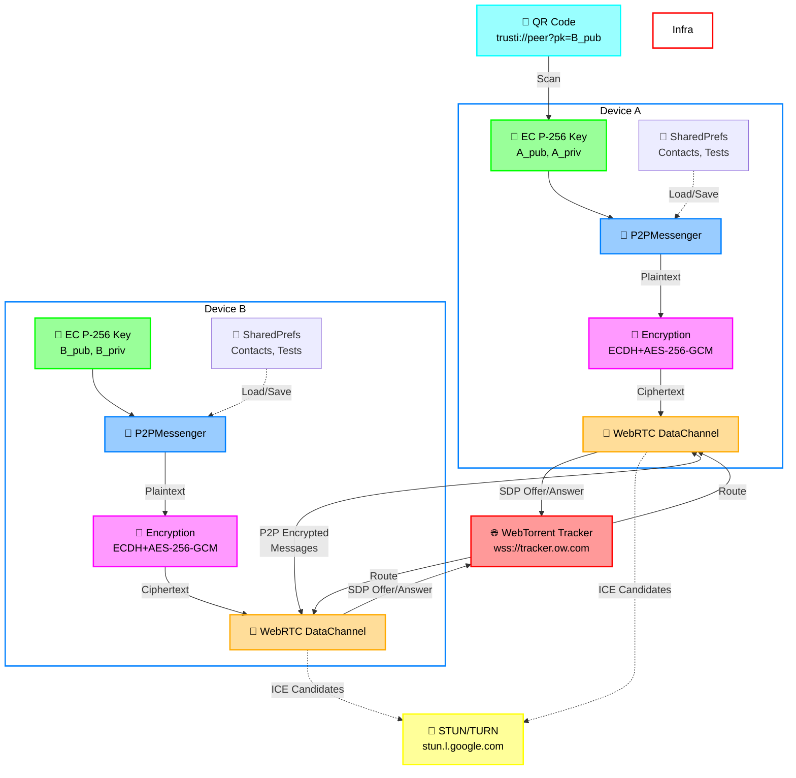
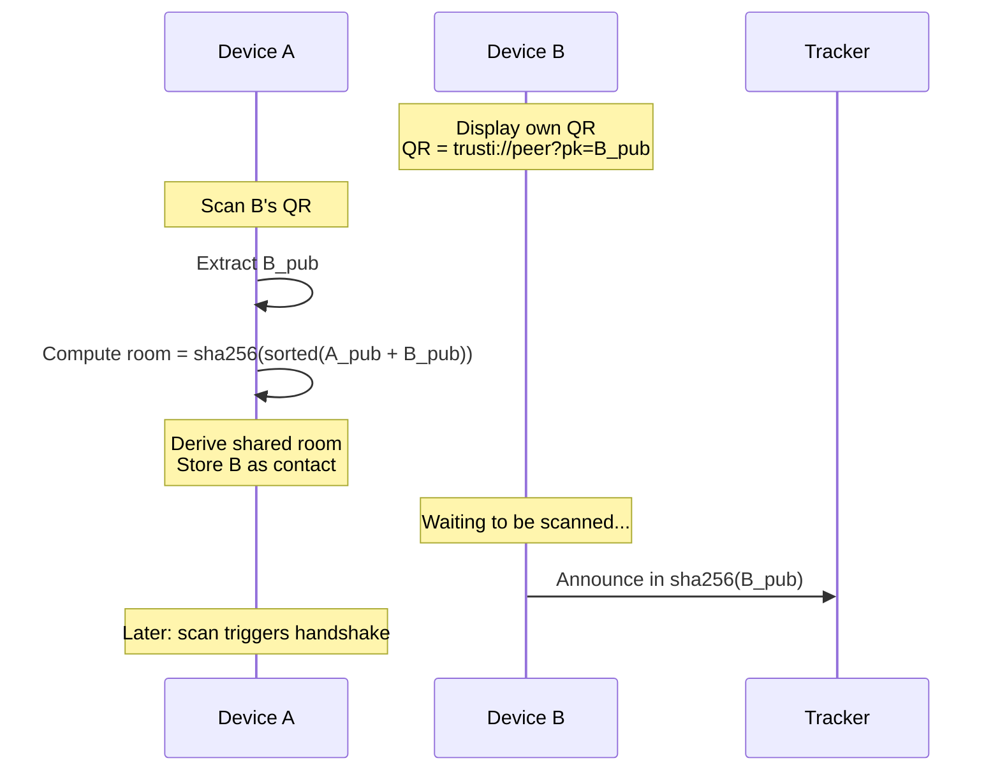
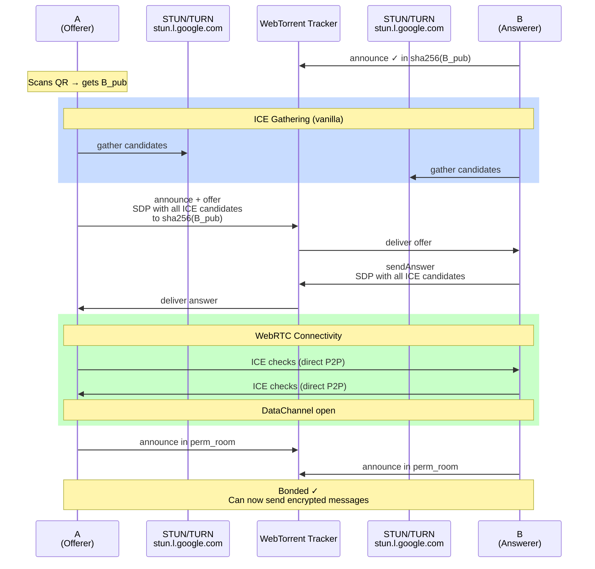
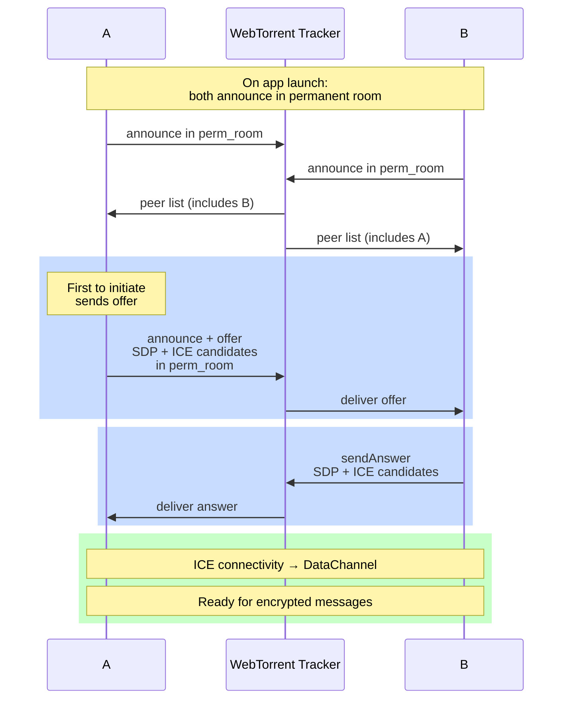
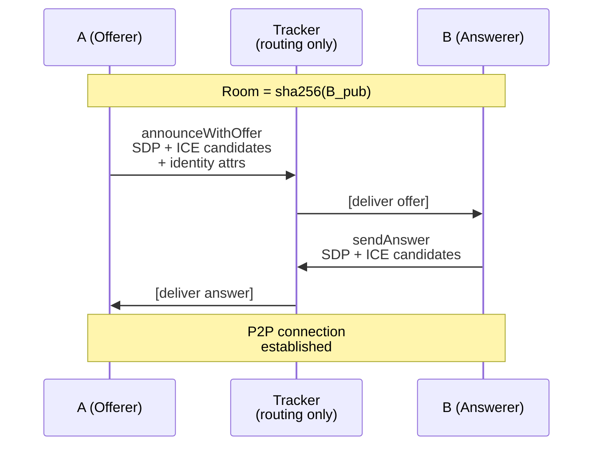
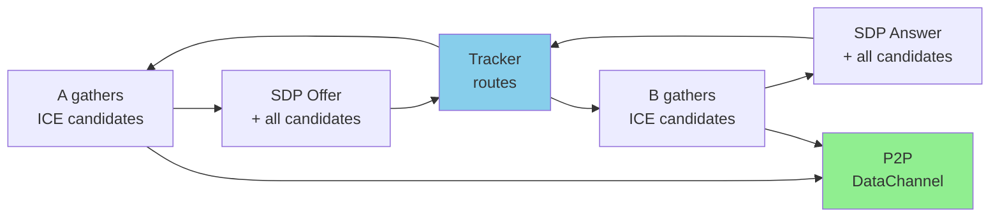
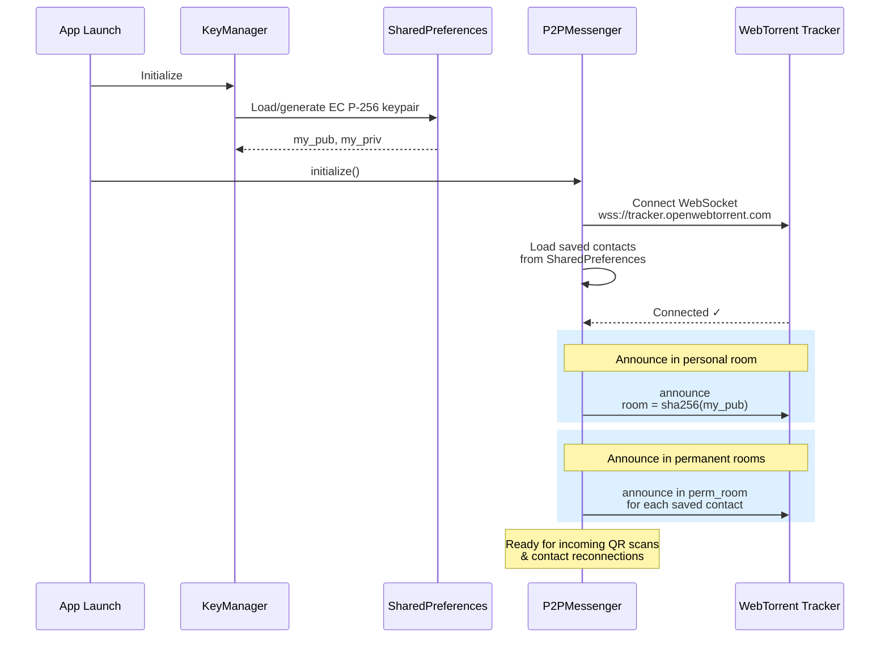
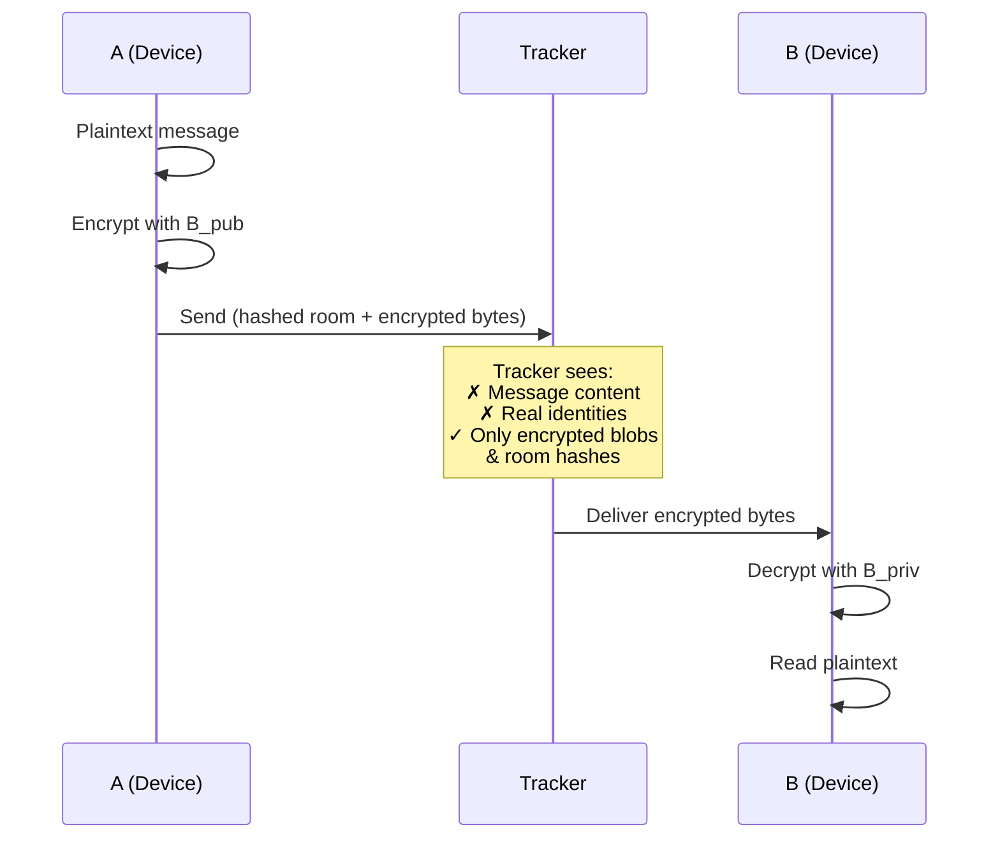

# TruSTI

A privacy-first Android app for sharing STI test results with trusted contacts. Two people exchange a QR code once; after that they can share encrypted health status updates peer-to-peer, with no server ever seeing message content.

**Architecture Overview:**



---

## Core Principles

1. **No central server:** Keys, encryption, messaging happen on-device or directly P2P
2. **Tracker = rendezvous only:** Routes SDP signaling; never stores/relays content
3. **One QR scan:** After first handshake, reconnects happen automatically via permanent room
4. **Ephemeral encryption:** Each message has its own key; past messages stay safe even if key stolen

---

## How It Works

### 1. Identity & Key Exchange

Every user has a permanent EC P-256 key pair generated on first launch and stored in SharedPreferences (`crypto/KeyManager.kt`). The public key is the user's identity — there is no account or server.

Adding a contact: scan their QR code. The QR encodes:
```
trusti://peer?pk=<BASE64URL_PUBKEY>
```

**QR Exchange Diagram:**


With B's public key (B_pub), A can:
- Derive permanent signaling room: `sha256(sorted(A_pub || B_pub))`
- Encrypt messages so only B can decrypt

### 2. Signaling via WebTorrent Tracker

Peers discover and exchange signaling through a public WebTorrent tracker (`wss://tracker.openwebtorrent.com`). **The tracker routes only encrypted SDP offers/answers — never message content.**

**Room Types (all SHA-256 hashed):**

| Room Type | Key | Purpose |
| --- | --- | --- |
| **Personal** | `sha256(my_public_key)` | I listen here; new peers reach me after scanning my QR |
| **Permanent** | `sha256(sorted(A_pub \|\| B_pub))` | Both peers announce here; enables reconnection without scanning |

**Room Hashing:** Keys are concatenated lexicographically then hashed. Example: if A_pub < B_pub (byte comparison), then room = sha256(A_pub || B_pub). Both peers compute the same room ID independently.

#### First-Time Connection Flow (A scans B's QR)



**Key point:** ICE candidates are bundled in the SDP (vanilla ICE), not trickled separately—required because the tracker only understands announce/answer messages.

**After bonding:** Both peers derive and announce in the permanent room. Reconnects happen without QR scanning.

#### Reconnection Flow (both peers have each other saved)



#### Participant Roles

**A (Offerer / Initiator):**
- Has B's public key (scanned QR or saved contact)
- Initiates handshake by creating WebRTC offer
- Gathers ICE candidates locally
- Sends offer + all candidates to tracker in one message

**Tracker (Rendezvous Point):**
- Routes WebRTC signaling only—never sees plaintext
- Peers announce to enter a "room"
- Delivers offer/answer between A and B via announce protocol
- **No storage, no relay:** stateless routing

**B (Answerer / Listener):**
- Listens in personal room: `sha256(B_pub)`
- Receives A's offer from tracker
- Gathers own ICE candidates
- Sends answer + candidates back via tracker
- Both devices form direct DataChannel

#### Signaling Message Flow



**Identity:** Public key + display name in SDP as `a=x-trusti-*` attributes—B knows who called without needing a server.

### 3. WebRTC Data Channel (Vanilla ICE)

Once signaling completes, a direct P2P encrypted channel opens between devices (`smp/WebRtcTransport.kt`).

**Vanilla ICE (Complete Mode):**
- All ICE candidates gathered **before** sending SDP
- Bundled into offer/answer at once
- **Why:** WebTorrent tracker only understands announce/answer protocol, not trickle ICE messages



**NAT Traversal:**
- Google STUN servers: public IP + port discovery
- OpenRelay TURN: fallback for symmetric NAT (bandwidth relay)

**Auto-initiate:** If offline when message sent, handshake triggers automatically; message queued and delivered on open.

### 4. End-to-End Encryption

Every message is encrypted **before** handing to WebRTC. Even if captured, content is unreadable without the recipient's private key.

**Algorithm: ECDH (ephemeral) + AES-256-GCM** (`smp/Encryption.kt`)

**Sender (A) encrypts for recipient (B):**
```
plaintext → [gen ephemeral key pair]
         → [ECDH: ephemeral_priv XOR B_pub]
         → [derive AES-256 key via SHA-256]
         → [gen random 12-byte IV]
         → [AES-256-GCM encrypt + auth tag]
         → wire format: [ephPubLen|ephPubDER|IV|ciphertext|tag]
```

**Recipient (B) decrypts:**
```
wire format → [parse ephemeral_pub, IV, ciphertext]
           → [ECDH: B_priv XOR ephemeral_pub]
           → [derive same AES-256 key via SHA-256]
           → [AES-256-GCM decrypt + verify auth tag]
           → plaintext (or ❌ fail if tampered)
```

**Ephemeral key per message:** No long-term shared secret; no key reuse. Past messages stay safe even if long-term key is compromised (forward secrecy).

### 5. Message Types

All messages are JSON (then encrypted). Three types:

| Type | Payload | Purpose |
| --- | --- | --- |
| `text` | `{from, content, ts}` | Chat message |
| `status_request` | `{from}` | Ask peer: do you have a positive test? |
| `status_response` | `{from, hasPositive, queuedAt?}` | Reply: yes/no + delivery timestamp |

**Status Delivery:** If B is offline when A sends a status update, A stores it in `PendingStatusStore`. When B reconnects, the status is delivered atomically (read-once, then sent). Only the latest status per contact is kept—no backlog.

---

## Storage and Caching

### Persistent storage (survives process death)

All persistent state lives in Android `SharedPreferences` as JSON strings — no database, no files.

| Store                | Prefs key               | Contents                                                          | Notes                                                                           |
| -------              | -----------             | ----------                                                        | -------                                                                         |
| `KeyManager`         | `trusti_keys`           | EC P-256 key pair (DER-encoded)                                   | Generated once on first launch; never leaves the device                         |
| `ContactStore`       | `trusti_contacts`       | List of up to 50 contacts (name, public key, last disease status) | `isConnected` is always written as `false` — it is a runtime-only flag          |
| `TestsStore`         | `trusti_tests`          | Medical records (disease, date, POSITIVE / NEGATIVE)              | Read on every incoming `sreq` to compute the current positive flag              |
| `PendingStatusStore` | `trusti_pending_status` | One queued status update per offline contact                      | Entries expire after 7 days; consumed atomically when the contact next connects |
| `ProfileManager`     | `trusti_profile`        | Display name + disambiguation suffix                              | Set once during onboarding                                                      |

### In-session state (cleared on process death)

`P2PMessenger` is a process-lifetime singleton. The following maps live purely in memory and are rebuilt from scratch on every app launch:

| Field                      | Type                                     | Purpose                                                                                              |
| -------                    | ------                                   | ---------                                                                                            |
| `transports`               | `ConcurrentHashMap<pk, WebRtcTransport>` | One active DataChannel per connected peer                                                            |
| `pendingOffers`            | `ConcurrentHashMap<offerId, pk>`         | Tracks offers A sent so incoming answers can be matched                                              |
| `pendingApproval`          | `Set<pk>`                                | Peers whose incoming-request dialog has not been answered yet                                        |
| `pendingHandshakes`        | `Queue<Contact>`                         | Handshakes queued before the tracker WebSocket connected                                             |
| `retryJobs`                | `ConcurrentHashMap<pk, Job>`             | Active offer-retry coroutines (re-announce every 5 s, up to 6 times)                                 |
| `newlyBondedContacts`      | `Set<pk>`                                | Peers that bonded in this session — drives the "new bond" confirmation dialog                        |
| `handledOffers`            | `ConcurrentHashMap<pk, offerId>`         | Dedup cache: the last offer ID processed per peer; capped at 100 entries to prevent unbounded growth |
| `pendingAccepts`           | `Set<pk>`                                | B-side: approved contacts waiting for the DataChannel to open before sending `acc`                   |
| `isConnected` on `Contact` | `Boolean`                                | Set to `true` in memory when a transport opens; always `false` when loaded from disk                 |

### Startup Sequence



**State after startup:**
- All contacts have `isConnected = false` (memory only)
- Personal room active → can receive incoming scans
- Permanent rooms active → can receive peer announcements for existing bonds

### Pending status delivery

When a test result changes and a contact is offline, the latest status is written to `PendingStatusStore`. The existing entry for that contact is replaced (not appended), so only the most recent status is ever queued. When the contact's DataChannel opens, `deliverPendingStatus()` atomically reads and removes the entry, then sends it over the encrypted channel.

---

## Privacy Properties

**What the tracker sees:**
- Hashed room IDs (sha256 values—cannot be reversed)
- SDP offer/answer (connection handshake only—no content)
- Peer announcements (time + room—no metadata)

**What the tracker does NOT see:**
- Message content (encrypted end-to-end)
- Real identities (only public key hashes)
- Contact relationships (different per pair)
- Test results, health data, anything about users



| Property | How achieved |
| --- | --- |
| **No server stores messages** | End-to-end encrypted; only encrypted bytes route through tracker |
| **No server knows identity** | Keys generated locally; tracker sees only room hashes |
| **Forward secrecy** | Ephemeral key per message—past intercepts unreadable even if long-term key stolen |
| **Authenticated encryption** | AES-GCM tag; tampering detected immediately (fail-safe) |
| **Contact privacy** | Different room per pair; tracker can't link contacts together |

---

## Project Structure

```
app/src/main/java/com/davv/trusti/
├── crypto/
│   └── KeyManager.kt          EC P-256 key pair generation and storage
├── connection/
│   └── QrHelper.kt            QR generation and PeerInfo parsing
├── model/
│   ├── Contact.kt             name, publicKey, lastSeen
│   ├── Message.kt             chat message
│   └── MedicalRecord.kt       test result (disease, date, POSITIVE/NEGATIVE)
├── smp/
│   ├── Encryption.kt          ECDH + AES-256-GCM encrypt/decrypt
│   ├── TorrentSignaling.kt    WebTorrent tracker WebSocket client
│   ├── WebRtcTransport.kt     RTCPeerConnection + DataChannel per contact
│   └── P2PMessenger.kt        Singleton orchestrating signaling, transport, encryption
├── utils/
│   ├── ContactStore.kt        JSON persistence for contacts
│   ├── MessageStore.kt        Per-contact message persistence
│   ├── MedicalStore.kt        JSON persistence for medical records
│   ├── PendingStatusStore.kt  Queued status updates for offline contacts
│   └── ProfileManager.kt      Display name + disambiguation (adjective-noun)
└── ui/
    ├── CommonComponents.kt
    ├── DiseaseTestResult.kt   Disease row with +/−/? chips
    └── DiseaseTestList.kt     List of diseases with results
```

---

## Build

- minSdk 26 (Android 8.0)
- targetSdk / compileSdk 36
- Kotlin 2.0.21, AGP 8.7.3, Gradle 8.11+

```bash
./gradlew assembleDebug
```
