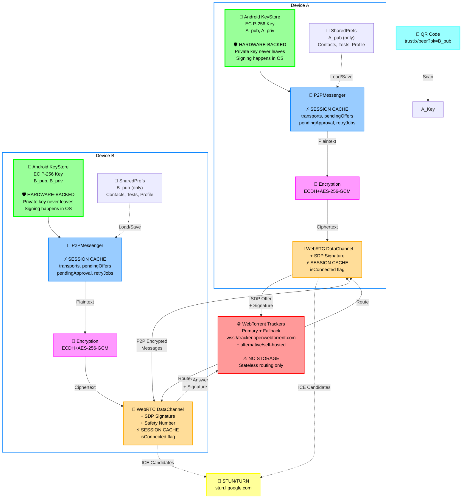
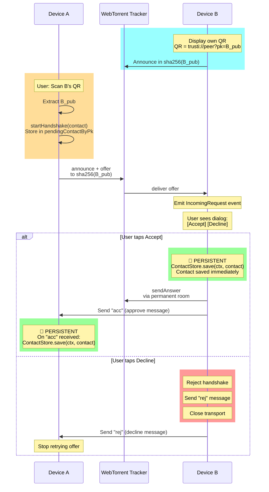
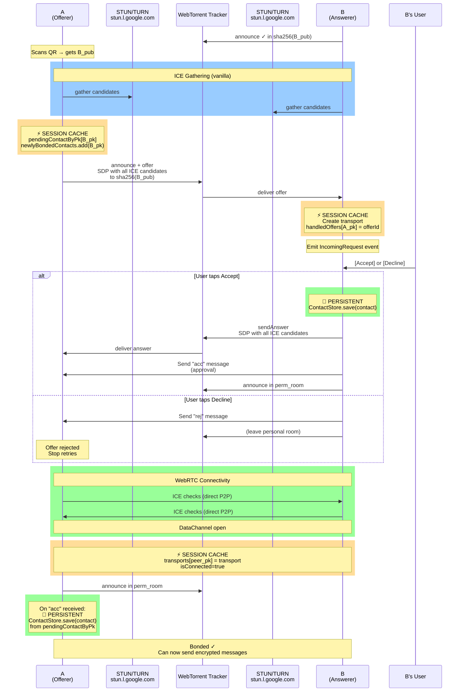
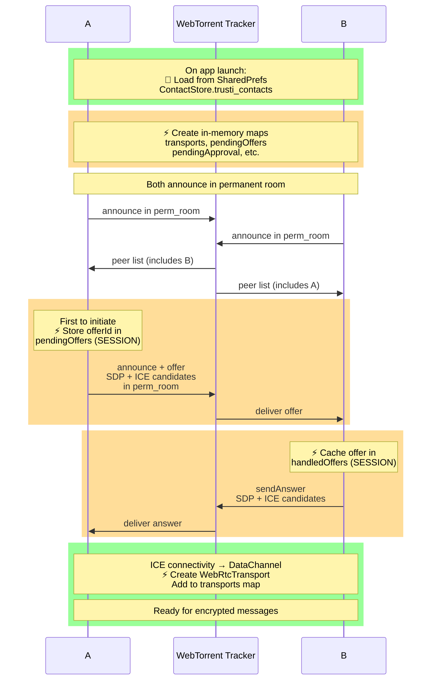
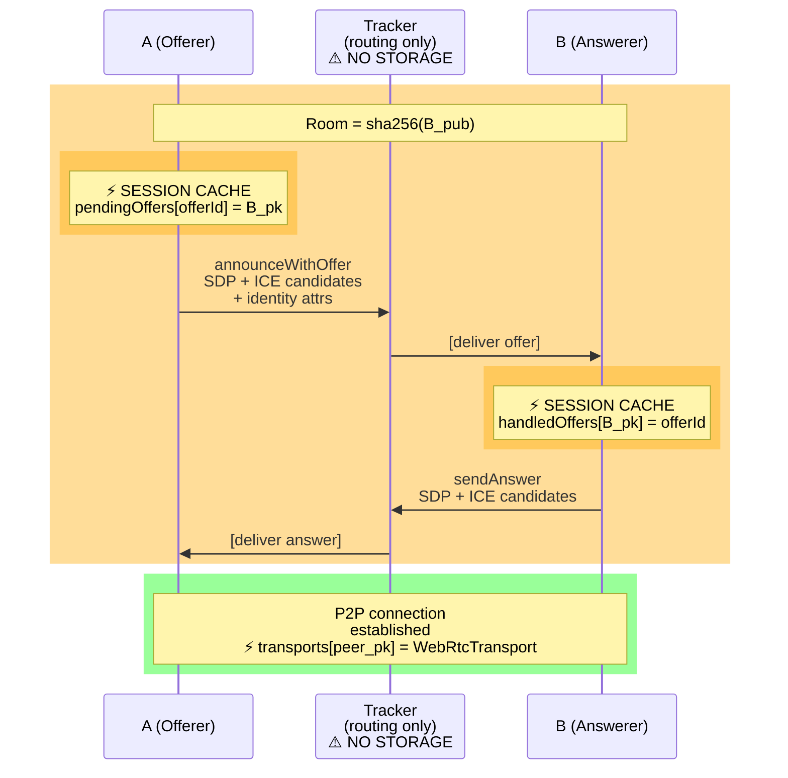
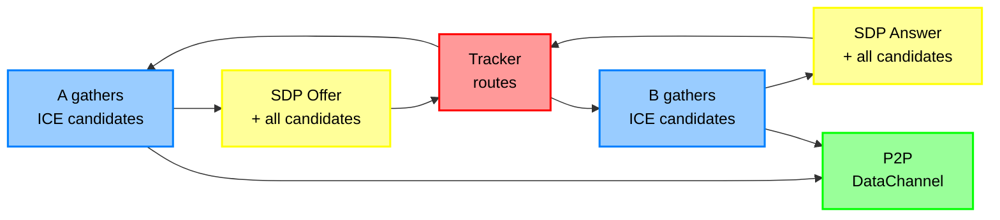
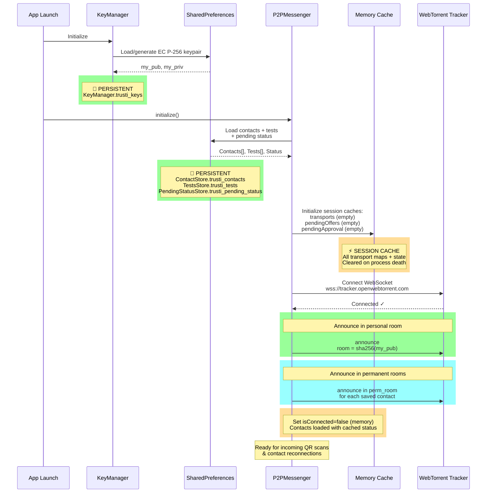
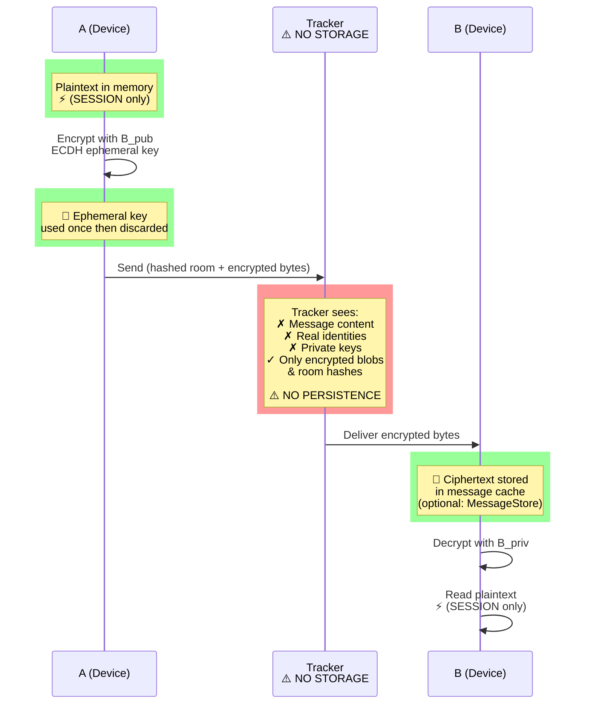

# TruSTI

A privacy-first Android app for sharing STI test results with trusted contacts. Two people exchange a QR code once; after that they can share encrypted health status updates peer-to-peer, with no server ever seeing message content.

**Architecture Overview (Final with Mitigations):**



---

## Core Principles

1. **No central server:** Keys, encryption, messaging happen on-device or directly P2P
2. **Tracker = rendezvous only:** Routes SDP signaling; never stores/relays content
3. **One QR scan:** After first handshake, reconnects happen automatically via permanent room
4. **Ephemeral encryption:** Each message has its own key; past messages stay safe even if key stolen

---

## How It Works

### 1. Identity & Key Exchange

Every user has a permanent EC P-256 key pair generated on first launch and stored in SharedPreferences (`crypto/KeyManager.kt`). The public key is the user's identity — there is no account or server.

Adding a contact: scan their QR code. The QR encodes:
```
trusti://peer?pk=<BASE64URL_PUBKEY>
```

**QR Exchange Diagram:**


With B's public key (B_pub), A can:
- Derive permanent signaling room: `sha256(sorted(A_pub || B_pub))`
- Encrypt messages so only B can decrypt

**Contact Saving Lifecycle:**

| Event          | Side | Action                                              | Storage          |
| -------------- | ---- | --------------------------------------------------- | ---------------- |
| User scans QR  | A    | Store contact in `pendingContactByPk`, send offer   | ⚡ SESSION        |
| Offer received | B    | Show accept/decline dialog                          | ⚡ SESSION        |
| User accepts   | B    | Save contact immediately, send "acc"               | 💾 PERSISTENT     |
| "acc" received | A    | Save contact from `pendingContactByPk`              | 💾 PERSISTENT     |
| User declines  | B    | Send "rej", close transport                         | ❌ Not saved     |
| "rej" received | A    | Stop retries, remove from pending                   | ❌ Not saved     |
| DataChannel op | A/B  | Mark `isConnected=true` (memory only)               | ⚡ SESSION        |

### 2. Signaling via WebTorrent Tracker

Peers discover and exchange signaling through a public WebTorrent tracker (`wss://tracker.openwebtorrent.com`). **The tracker routes only encrypted SDP offers/answers — never message content.**

**Room Types (all SHA-256 hashed):**

| Room Type     | Key                              | Purpose                                                |
| ------------- | -------------------------------- | ------------------------------------------------------ |
| **Personal**  | `sha256(my_public_key)`          | I listen here; new peers reach me after scanning my QR |
| **Permanent** | `sha256(sorted(A_pub \|\| B_pub))` | Both peers announce here; enables reconnection         |

**Room Hashing:** Keys are concatenated lexicographically then hashed. Example: if A_pub < B_pub (byte comparison), then room = sha256(A_pub || B_pub). Both peers compute the same room ID independently.

#### First-Time Connection Flow (A scans B's QR)

**Two-phase bonding:**
- Phase 1: A sends offer, B shows dialog
- Phase 2: B user accepts → B saves contact → B sends "acc" → A saves contact



**Key point:** ICE candidates are bundled in the SDP (vanilla ICE), not trickled separately—required because the tracker only understands announce/answer messages.

**Answer routing:** B sends answer back on the **same room** where the offer came from:
- First-time (handshake): Offer → sha256(B_pub), Answer → sha256(B_pub)
- Reconnect (permanent): Offer → sha256(A_pub ∥ B_pub), Answer → sha256(A_pub ∥ B_pub)

**After bonding:** Both peers derive and announce in the permanent room. Reconnects happen without QR scanning.

#### Reconnection Flow (both peers have each other saved)



#### Participant Roles

**A (Offerer / Initiator):**
- Has B's public key (scanned QR or saved contact)
- Initiates handshake by creating WebRTC offer
- Gathers ICE candidates locally
- Sends offer + all candidates to tracker in one message

**Tracker (Rendezvous Point):**
- Routes WebRTC signaling only—never sees plaintext
- Peers announce to enter a "room"
- Delivers offer/answer between A and B via announce protocol
- **No storage, no relay:** stateless routing

**B (Answerer / Listener):**
- Listens in personal room: `sha256(B_pub)`
- Receives A's offer from tracker
- Gathers own ICE candidates
- Sends answer + candidates back via tracker
- Both devices form direct DataChannel

#### Signaling Message Flow



**Identity:** Public key + display name in SDP as `a=x-trusti-*` attributes—B knows who called without needing a server.

### 3. WebRTC Data Channel (Vanilla ICE)

Once signaling completes, a direct P2P encrypted channel opens between devices (`smp/WebRtcTransport.kt`).

**Vanilla ICE (Complete Mode):**
- All ICE candidates gathered **before** sending SDP
- Bundled into offer/answer at once
- **Why:** WebTorrent tracker only understands announce/answer protocol, not trickle ICE messages



**NAT Traversal:**
- Google STUN servers: public IP + port discovery
- OpenRelay TURN: fallback for symmetric NAT (bandwidth relay)

**Auto-initiate:** If offline when message sent, handshake triggers automatically; message queued and delivered on open.

### 4. End-to-End Encryption

Every message is encrypted **before** handing to WebRTC. Even if captured, content is unreadable without the recipient's private key.

**Algorithm: ECDH (ephemeral) + AES-256-GCM** (`smp/Encryption.kt`)

**Sender (A) encrypts for recipient (B):**
```
plaintext → [gen ephemeral key pair]
         → [ECDH: ephemeral_priv XOR B_pub]
         → [derive AES-256 key via SHA-256]
         → [gen random 12-byte IV]
         → [AES-256-GCM encrypt + auth tag]
         → wire format: [ephPubLen|ephPubDER|IV|ciphertext|tag]
```

**Recipient (B) decrypts:**
```
wire format → [parse ephemeral_pub, IV, ciphertext]
           → [ECDH: B_priv XOR ephemeral_pub]
           → [derive same AES-256 key via SHA-256]
           → [AES-256-GCM decrypt + verify auth tag]
           → plaintext (or ❌ fail if tampered)
```

**Ephemeral key per message:** No long-term shared secret; no key reuse. Past messages stay safe even if long-term key is compromised (forward secrecy).

### 5. Message Types

All messages are JSON (then encrypted). Sent over the DataChannel after bonding is complete.

#### User-Facing Messages

| Type   | Payload                         | Purpose                     | Direction      |
| ------ | ------------------------------- | --------------------------- | -------------- |
| `text` | `{from, content, ts}`           | Chat message                | Bidirectional  |
| `sreq` | `{"t": "sreq"}`                 | **Status Request**          | A → B          |
| `srsp` | `{"t": "srsp", "pos": boolean}` | **Status Response**         | B → A          |

**Example flow:**
1. A opens contact → sends `sreq`
2. B receives `sreq` → reads `TestsStore` (current test results)
3. B sends `srsp` with boolean flag indicating positive test
4. A receives `srsp` → updates UI with B's current status
5. If B is offline, A queues the update in `PendingStatusStore` (expires after 7 days)

#### Internal Protocol Messages (Bonding & Lifecycle)

| Type  | Payload         | Purpose           | When                                    |
| ----- | --------------- | ----------------- | --------------------------------------- |
| `acc` | `{"t": "acc"}`  | **Accept**        | B sends when user taps "Accept"         |
| `rej` | `{"t": "rej"}`  | **Reject**        | B sends when user taps "Decline"        |
| `bye` | `{"t": "bye"}`  | **Goodbye**       | Either side sends when removing contact |

**Bond lifecycle:**
1. A scans QR → creates offer (no message yet—offer via tracker)
2. B receives offer → shows dialog
3. B user accepts → B sends `acc` → A receives `acc` → A saves contact
4. (Alternatively) B user declines → B sends `rej` → A stops retrying, bond fails
5. Later, user removes contact → sends `bye` → peer deletes bond too

**Key insight:** `acc`/`rej`/`bye` are internal protocol messages that happen AFTER the DataChannel is open, unlike the SDP offer/answer which travel through the tracker during handshake.

---

## Storage and Caching

### Persistent storage (survives process death)

All persistent state lives in Android `SharedPreferences` as JSON strings — no database, no files.

| Store                | Prefs key               | Contents                                     | Notes                       |
| -------------------- | ----------------------- | -------------------------------------------- | --------------------------- |
| `KeyManager`         | `trusti_keys`           | EC P-256 key pair                            | Generated once on launch    |
| `ContactStore`       | `trusti_contacts`       | List of up to 50 contacts                    | `isConnected` is runtime    |
| `TestsStore`         | `trusti_tests`          | Medical records                              | Read on every `sreq`        |
| `PendingStatusStore` | `trusti_pending_status` | One queued update per peer                   | Entries expire after 7 days |
| `ProfileManager`     | `trusti_profile`        | Display name + disambiguation                | Set once during onboarding  |

### In-session state (cleared on process death)

`P2PMessenger` is a process-lifetime singleton. The following maps live purely in memory and are rebuilt from scratch on every app launch:

| Field                 | Type                                     | Purpose                                     |
| --------------------- | ---------------------------------------- | ------------------------------------------- |
| `transports`          | `ConcurrentHashMap<pk, WebRtcTransport>` | Active DataChannels                         |
| `pendingOffers`       | `ConcurrentHashMap<offerId, pk>`         | Track sent offers                           |
| `pendingApproval`     | `Set<pk>`                                | Unanswered bond requests                    |
| `pendingHandshakes`   | `Queue<Contact>`                         | Handshakes queued for tracker               |
| `retryJobs`           | `ConcurrentHashMap<pk, Job>`             | Active retry coroutines                     |
| `newlyBondedContacts` | `Set<pk>`                                | Peers bonded this session                   |
| `handledOffers`       | `ConcurrentHashMap<pk, offerId>`         | Dedup cache (max 100 entries)               |
| `pendingAccepts`      | `Set<pk>`                                | Approved contacts waiting for DC            |
| `isConnected`         | `Boolean`                                | Runtime flag on `Contact`                   |

### Startup Sequence



**State after startup:**
- All contacts have `isConnected = false` (memory only)
- Personal room active → can receive incoming scans
- Permanent rooms active → can receive peer announcements for existing bonds

### Pending status delivery

When a test result changes and a contact is offline, the latest status is written to `PendingStatusStore`. The existing entry for that contact is replaced (not appended), so only the most recent status is ever queued. When the contact's DataChannel opens, `deliverPendingStatus()` atomically reads and removes the entry, then sends it over the encrypted channel.

---

## Privacy Properties

**What the tracker sees:**
- Hashed room IDs (sha256 values—cannot be reversed)
- SDP offer/answer (connection handshake only—no content)
- Peer announcements (time + room—no metadata)

**What the tracker does NOT see:**
- Message content (encrypted end-to-end)
- Real identities (only public key hashes)
- Contact relationships (different per pair)
- Test results, health data, anything about users



| Property                     | How achieved                                                 |
| ---------------------------- | ------------------------------------------------------------ |
| **No server stores messages** | E2E encrypted; only encrypted bytes route through tracker    |
| **No server knows identity**  | Keys generated locally; tracker sees only room hashes        |
| **Forward secrecy**          | Ephemeral key per message                                    |
| **Authenticated encryption**  | AES-GCM tag; tampering detected immediately                  |
| **Contact privacy**          | Different room per pair; tracker can't link contacts         |

---

## Error Handling & Recovery

**Tracker Disconnect (Mid-Session)**

| Scenario                     | Behavior                                      | Recovery                               |
| ---------------------------- | --------------------------------------------- | -------------------------------------- |
| **Tracker unreachable**      | Emit `TrackerError` event                     | Retry with exponential backoff         |
| **Tracker drops**            | All pending offers marked stale               | Reannounce in rooms on reconnect       |
| **Tracker timeout**          | Close WebSocket, treat as disconnect          | Immediate failover / reconnect         |

**ICE Candidate Gathering Failure**

| Scenario                     | Behavior                                      | Recovery                               |
| ---------------------------- | --------------------------------------------- | -------------------------------------- |
| **STUN/TURN unreachable**    | No host candidates; only relay                | Attempt to send offer anyway           |
| **NAT traversal impossible** | ICE checks fail; no P2P connection            | User sees "Cannot reach {contact}"     |
| **ICE candidate timeout**    | No candidates gathered after 10s              | Send offer/answer with existing ones   |

**Message Delivery Race Conditions**

| Scenario                     | Problem                                       | Resolution                             |
| ---------------------------- | --------------------------------------------- | -------------------------------------- |
| **"acc" lost**               | B thinks bonded, A thinks not                 | A retries offer automatically          |
| **DC open but no "acc"**     | Message buffer fills; out of order            | Mark "acc" as priority; send first     |
| **Accept but no DC**         | Both think bonded but can't message           | Detect timeout; user manual retry      |

---

## P2PMessenger State Machine

**Connection Lifecycle States per Peer:**

```
┌─────────────────────────────────────────────────────────────────┐
│  IDLE (no contact saved)                                        │
│  • No transport exists                                          │
│  • No pending state                                             │
│  • Events: [startHandshake → OFFERING]                          │
└─────────────────────────────────────────────────────────────────┘
              ↑
              │ closeContact()
              │
┌─────────────────────────────────────────────────────────────────┐
│  OFFERING (A: sent offer, waiting for answer)                   │
│  • pendingOffers[offerId] = contact.pk                          │
│  • retryJob active (5s interval, max 6 retries)                 │
│  • Events: [answer → CONNECTING] [rej → IDLE] [timeout → IDLE] │
└─────────────────────────────────────────────────────────────────┘
              ↓
┌─────────────────────────────────────────────────────────────────┐
│  ANSWERING (B: received offer, waiting for user decision)       │
│  • handledOffers[contact.pk] = offerId                          │
│  • pendingApproval.contains(contact.pk)                         │
│  • Events: [accept → ACCEPTING] [reject → IDLE]                │
└─────────────────────────────────────────────────────────────────┘
              ↓
┌─────────────────────────────────────────────────────────────────┐
│  ACCEPTING (B: user accepted, sending answer SDP)               │
│  • transport created & answer sent                              │
│  • pendingAccepts.contains(contact.pk)                          │
│  • Events: [DataChannel.onOpen → CONNECTED] [error → IDLE]     │
└─────────────────────────────────────────────────────────────────┘
              ↓
┌─────────────────────────────────────────────────────────────────┐
│  CONNECTING (both: ICE connectivity checks in progress)         │
│  • transport.state = CONNECTING                                 │
│  • No messages sent/received yet                                │
│  • Timeout: 30s, then fail to IDLE                              │
│  • Events: [DataChannel.onOpen → CONNECTED] [error → IDLE]     │
└─────────────────────────────────────────────────────────────────┘
              ↓
┌─────────────────────────────────────────────────────────────────┐
│  CONNECTED (both: DataChannel open, can exchange messages)      │
│  • transport.state = OPEN                                       │
│  • isConnected = true (memory-only flag)                        │
│  • Can send/recv text, sreq, srsp, acc, rej, bye, etc.         │
│  • Periodic keepalive: every 30s (empty message)                │
│  • Events: [message → process] [bye → CLOSING] [disconnect → RECONNECTING] │
└─────────────────────────────────────────────────────────────────┘
      ↓              ↑
      │              │ (reconnect within 60s)
      │ (>60s idle)  │
┌─────────────────────────────────────────────────────────────────┐
│  RECONNECTING (peer went offline, auto-retry)                   │
│  • transport closed but contact still saved                     │
│  • Announce in permanent room; wait for peer to answer          │
│  • Retry timeout: 5 min of silence, then give up                │
│  • Events: [answer → CONNECTING → CONNECTED] [timeout → emit   │
│             ContactUnreachable event, then IDLE]                │
└─────────────────────────────────────────────────────────────────┘
              ↓
┌─────────────────────────────────────────────────────────────────┐
│  CLOSING (peer sent "bye", removing contact)                    │
│  • Send "bye" message (if transport open)                       │
│  • Clear transport + pending state                              │
│  • Remove from permanent room                                   │
│  • Events: [complete → IDLE]                                    │
└─────────────────────────────────────────────────────────────────┘
              ↓ (auto-transition)
           IDLE
```

**Activity/Service Lifecycle Integration:**

| Android State     | P2PMessenger Behavior                                    |
| ----------------- | -------------------------------------------------------- |
| **onCreate()**    | initialize(); loads contacts; connects to tracker        |
| **onResume()**    | Resume handshakes; accelerate reconnection retries       |
| **onPause()**     | No change to active connections                          |
| **Doze Mode**     | WebSocket may be killed; reconnect on app wake           |
| **onDestroy()**   | WebSocket closed; session cache wiped                    |

**Background Restrictions (Android 8+):**
- App cannot wake itself or access network in background after 15 min idle
- Incoming peer offers are **not** received if app is background for >1 min
- **Mitigation:** Use WorkManager to periodically refresh tracker connection every 10 min (if app is backgrounded); re-announce in rooms on app resume

---

## Threading & Concurrency Model

**Thread Ownership:**

| Component          | Thread                     | Ownership               | Mutability          |
| ------------------ | -------------------------- | ----------------------- | ------------------- |
| `P2PMessenger`     | Main + Coroutine IO        | Single instance         | Immutable ref       |
| `peerEventFlow`    | Flow consumer (UI)         | Coroutine scope         | Collect on UI       |
| `transports` map   | IO scope (WS + ICE)        | Accessed from callbacks | ConcurrentHashMap   |
| `pendingOffers`    | IO scope                   | Accessed from WS thread | ConcurrentHashMap   |
| `retryJobs` map    | Main                       | Coroutine scheduler     | ConcurrentHashMap   |
| WebSocket          | IO scope (OkHttp)          | Single connection       | Immutable channel   |

**Coroutine Scope Structure:**

```
// Global scope (app lifetime)
object P2PMessenger {
    private val scope: CoroutineScope = CoroutineScope(Dispatchers.IO + Job())

    // Per-contact handshake (store jobs for cancellation)
    private val retryJobs: Map[String, Job] = ConcurrentHashMap()

    fun startHandshake(contact: Contact) {
        val job = scope.launch {
            // Announce offer, retry every 5s up to 6 times
            repeat(6) {
                announceOffer()
                delay(5000)
            }
        }
        retryJobs[contact.pk] = job
    }

    // Event emission (safe to collect from Main thread)
    private val _peerEventFlow: Flow[PeerEvent] = MutableSharedFlow()
    val peerEventFlow: Flow[PeerEvent] = _peerEventFlow.asSharedFlow()

    // Safe cross-thread emission (suspends on backpressure)
    private suspend fun emit(event: PeerEvent) {
        _peerEventFlow.emit(event)
    }
}
```

**Race Condition Mitigations:**

| Race                   | Problem                                       | Solution                               |
| ---------------------- | --------------------------------------------- | -------------------------------------- |
| **Handshake + kill**   | Pending offer cleared before answer arrives   | Wait 10s for peer answer on restart    |
| **Dual offer**         | Duplicate transports                          | Compare public keys; lower PK initiates|
| **Send + disconnect**  | Message lost                                  | Queue messages in memory until open    |
| **Shutdown + retry**   | Job tries to access closed WS                 | Cancel all retryJobs in scope.cancel() |

---

## Message Serialization & Wire Format

**JSON Schema (v1):**

All messages exchanged over the encrypted DataChannel are JSON objects with a `t` (type) field:

**Message Types:**

| Type           | Required Fields                                              | Example                               |
| -------------- | ------------------------------------------------------------ | ------------------------------------- |
| `text`         | `from`, `content`, `ts`                                      | `{t:"text", from:"Alice", ...}`       |
| `sreq`         | (none)                                                       | `{t:"sreq"}`                          |
| `srsp`         | `pos` (boolean)                                              | `{t:"srsp", pos:true}`                |
| `acc`          | (none)                                                       | `{t:"acc"}`                           |
| `rej`          | (none)                                                       | `{t:"rej"}`                           |
| `bye`          | (none)                                                       | `{t:"bye"}`                           |
| `key_rotation` | `old_pk`, `new_pk`, `sig`                                    | `{t:"key_rotation", ...}`             |
| `revoke_bond`  | `reason`                                                     | `{t:"revoke_bond", ...}`              |

**Wire Format (Encrypted):**

```
[Encryption header: 2-byte keyLen]
[DER ephemeral pubkey: keyLen bytes]
[IV: 12 bytes]
[JSON payload: variable]
[GCM tag: 16 bytes]
```

**Versioning:**
- No explicit version field; backward compatibility maintained by optional fields only
- **Future versions:** Add `v: 2` field if incompatible changes needed
- **Migration:** Old clients reject messages with unknown `t` values; new clients ignore unknown fields

**Size Limits:**
- Max message size: 65 KB (after encryption)
- Max text content: 10,000 characters
- Max pending messages per contact: 1,000 (FIFO drop oldest if exceeded)

---

## Security & Privacy Issues

This section documents known security and privacy issues, their severity, and planned mitigations. These are intentionally transparent trade-offs rather than hidden bugs.

### 1. Private Keys in SharedPreferences ⚠️ **HIGH SEVERITY**

**Issue:**
EC P-256 private keys are generated at runtime and persisted as JSON strings in Android `SharedPreferences`. On a non-encrypted device or with root access, any process can read the raw SharedPreferences database file and extract the private key in plaintext.

**Impact:**
- Complete compromise of identity and all past messages if device is stolen
- No hardware security module protection
- Forward secrecy does not protect past messages if the device is compromised *after* the fact

**Current Status:**
Keys are stored in `crypto/KeyManager.kt` as DER-encoded strings. Safe enough for MVP but must be upgraded.

**Mitigation:**
Use Android `KeyStore` (available on API 23+, minSdk is 26):
- Generate and store private keys in the OS-level KeyStore
- Private keys never leave the Keystore; sign/ECDH operations happen inside
- Only public keys are readable from SharedPreferences
- Timeline: Required before production release

**Affected Files:**
- `crypto/KeyManager.kt` (generate/load logic)
- `smp/Encryption.kt` (ECDH, decrypt)
- `smp/WebRtcTransport.kt` (SDP signing)

---

### 2. Unauthenticated SDP Identity Attributes ⚠️ **HIGH SEVERITY**

**Issue:**
During the handshake, A sends an offer with `x-trusti-pk` and `x-trusti-name` SDP attributes. These attributes are **not signed or authenticated**. A malicious tracker operator can rewrite these attributes to impersonate a different peer.

**Impact:**
- B user accepts the bond thinking they are bonding with A, but they are bonded with Attacker.

**Current Status:**
No SDP signing is implemented. Identity is implicitly confirmed after the DataChannel opens, but initial handshake is vulnerable.

**Mitigation:**
Sign the SDP offer with A's private key:
- A computes a signature over `sha256(offer SDP)` using private key
- A includes the signature in an SDP attribute: `a=x-trusti-sig:<BASE64_SIG>`
- B receives offer, verifies signature using the scanned public key
- Timeline: Required before production release

**Affected Files:**
- `smp/WebRtcTransport.kt` (createOffer, handleOffer)
- `crypto/KeyManager.kt` (signing capability)

---

### 3. QR Code Exchange Lacks TOFU / Display Verification ⚠️ **MEDIUM SEVERITY**

**Issue:**
The QR code itself contains only B's public key. No verification step after scanning to ensure:
1. Scanned QR was actually displayed by B (not intercepted)
2. Person showing QR is actually the person you think they are

**Impact:**
- Shoulder-surfing or phishing attacks.

**Current Status:**
No out-of-band verification is implemented. Users verify identities through conversation after bonding.

**Mitigation (Post-MVP):**
Implement TOFU (Trust On First Use) with display verification:
- Show a **short safety number** on both devices during the handshake
- User confirms visually before accepting
- Timeline: Post-MVP

---

### 4. No Key Rotation or Bond Revocation Mechanism ⚠️ **MEDIUM SEVERITY**

**Issue:**
- If a device is lost or compromised, there is no mechanism to rotate keys or revoke bonds
- All contacts remain bonded with the compromised key

**Current Status:**
No rotation or revocation. Only option is to delete the app and start over.

**Mitigation (Post-MVP):**
Implement key rotation and optional bond revocation:
- **Key rotation:** User initiates "rotate keys" → sends "key_rotation" message to all contacts
- **Bond revocation:** Contacts can send "revoke_bond" to explicitly deny access
- Timeline: Recommended before any public release

---

### 5. WebTorrent Tracker Dependency with No Fallback ⚠️ **LOW SEVERITY**

**Issue:**
Relies on a single public WebTorrent tracker. If down or censored:
- New handshakes cannot complete
- Existing contacts cannot reconnect

**Current Status:**
Hardcoded in `smp/TorrentSignaling.kt`. No fallback mechanism.

**Mitigation (Post-MVP):**
Implement tracker resilience:
- **Multiple tracker support:** Redundancy
- **Self-hosted option:** Configurable tracker URL
- **Direct IP fallback:** For already-bonded contacts
- Timeline: Post-MVP

---

## Summary Table

| Issue                         | Severity | Category    | Mitigation                     | Timeline           |
| ----------------------------- | -------- | ----------- | ------------------------------ | ------------------ |
| Keys in SharedPreferences     | HIGH     | Storage     | Use Android KeyStore           | Required before PR |
| Unauthenticated SDP identity  | HIGH     | Handshake   | Sign SDP with private key      | Required before PR |
| QR lacks TOFU verification    | MEDIUM   | Phishing    | Add safety number verification | Post-MVP           |
| No key rotation / revocation  | MEDIUM   | Recovery    | Implement key rotation message  | Post-MVP           |
| Single tracker dependency     | LOW      | Reliability | Multi-tracker support          | Post-MVP           |

---

## Common Usage Flows

### Flow 1: A Scans B's QR Code

1. A Point camera at B's QR → taps "Scan"
2. A extracts B's public key and sends WebRTC offer to B's personal room
3. B receives A's offer and shows dialog: "Accept? [Y/N]"
4. If B accepts: B creates answer, DC opens, B sends "acc", A saves B.
5. If B declines: B sends "rej", A stops retrying.

### Flow 2: A Checks B's Test Status

1. A opens contact → sends "sreq"
2. B (online): Receives "sreq", reads results, sends "srsp"
3. B (offline): A queues request in `PendingStatusStore`
4. B comes back online: A delivers queued status

### Flow 3: A Removes B from Contacts

1. A long-press on B → Delete
2. A sends "bye" to B (if connected), clears session cache, deletes B from disk.
3. B (online): Receives "bye", also deletes A.

### Flow 4: Reconnection After App Restart

1. Both load saved contacts and announce in permanent rooms.
2. Tracker delivers peer lists.
3. Initiator creates offer in permanent room.
4. Answerer creates answer (no dialog).
5. DataChannel opens → sync latest status.

---

## Public API

### P2PMessenger (Main Singleton)

```kotlin
val messenger = P2PMessenger.get(context)
```

- **`initialize()`**: Init keys, connect tracker, join rooms.
- **`startHandshake(contact)`**: Initiate bond via QR scan.
- **`approveIncomingRequest(pk)`**: B accepts bond.
- **`rejectIncomingRequest(pk)`**: B declines bond.
- **`closeContact(pk)`**: Remove bond.
- **`peerEventFlow`**: Collect incoming events.

### Encryption

- **`encrypt(plaintext, recipientPub)`**: ECDH + AES-256-GCM.
- **`decrypt(data, privateKey)`**: Parsed wire format + ECDH decrypt.

### WebRtcTransport

- **`createOffer()`**: Initiator side (vanilla ICE).
- **`handleOffer(sdp, offerId, peerId)`**: Answerer side (vanilla ICE).
- **`handleAnswer(sdp)`**: Initiator side sets remote answer.

### TorrentSignaling

- **`announce(roomId)`**: Join room.
- **`announceWithOffer(roomId, offerId, sdp, ...)`**: Send offer.
- **`sendAnswer(roomId, toPeerId, offerId, sdp)`**: Send answer.

---

## Project Structure

```
app/src/main/java/com/davv/trusti/
├── crypto/
│   └── KeyManager.kt          Key storage
├── connection/
│   └── QrHelper.kt            QR gen/parse
├── model/
│   ├── Contact.kt             Peer model
│   └── MedicalRecord.kt       Test results
├── smp/
│   ├── Encryption.kt          E2E Crypto
│   ├── TorrentSignaling.kt    Tracker WS
│   ├── WebRtcTransport.kt     WebRTC stack
│   └── P2PMessenger.kt        P2P Orchestrator
├── utils/
│   ├── ContactStore.kt        Persistence
│   └── ProfileManager.kt      User profile
└── ui/
    ├── CommonComponents.kt
    └── DiseaseTestResult.kt   UI components
```

---

## User Features

### QR Code Display
- **Tap the QR code** to see contents.
- URI: `trusti://peer?pk=<PK>&u=<USER>&d=<DISAMBIG>`

---

## Implementation Notes & Constraints

### Issue #1: RECONNECTING Silent Gap (RESOLVED)
- Emit `ContactUnreachable(contact)` event after 5 min timeout.

### Issue #2: pendingContactByPk Session-Only (INTENTIONAL)
- Contact lost if A dies before "acc" received. User must re-scan.

### Issue #3: Encryption.kt API Design for KeyStore (HIGH PRIORITY)
- Transition from raw `PrivateKey` to `keystoreAlias`.

```kotlin
fun decrypt(data: ByteArray, keystoreAlias: String): ByteArray
```

---

## Build

- minSdk 26 (Android 8.0)
- targetSdk / compileSdk 36
- Kotlin 2.0.21, AGP 8.7.3

```bash
./gradlew assembleDebug
```
